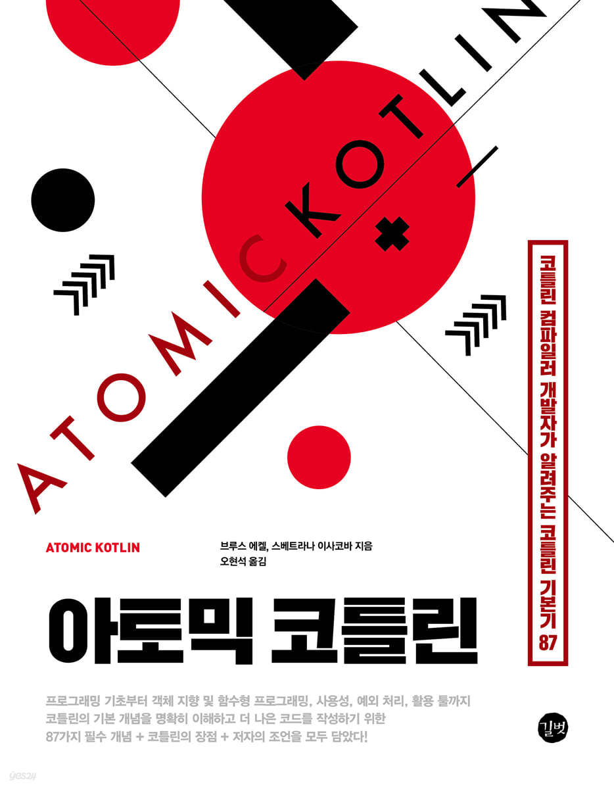

# 아토믹 코틀린 스터디

## 맴버
- [Hju95](https://github.com/Hju95)
- [yoonseon12](https://github.com/yoonseon12)
- [stoneHee99](https://github.com/stoneHee99)

## 도서

## 진행 방식
- 주 1회 진행
- 지정된 책 분량을 독서 및 학습
- 발표자료 준비 후 스터디 시작 전 무작위 추첨으로 발표자 선정

## 진행 내역

|    | 제목                                                                                  | 발표자 | 스터디 일자       |
|----|-------------------------------------------------------------------------------------|-----------|--------------|
| 1부 | [프로그래밍 기초](https://github.com/brdm-study/atomic-kotlin-study/tree/main/chapter1)    | [Hju95](https://github.com/Hju95) | 24. 7. 4. 목  |
| 2부 | [객체 소개](https://github.com/brdm-study/atomic-kotlin-study/tree/main/chapter2)       | [yoonseon12](https://github.com/yoonseon12) | 24. 7. 11. 목 |
| 3부 | [사용성](https://github.com/brdm-study/atomic-kotlin-study/tree/main/chapter3)         | [stoneHee99](https://github.com/stoneHee99) | 24. 7. 18. 목 |
| 4부 | [함수형 프로그래밍](https://github.com/brdm-study/atomic-kotlin-study/tree/main/chapter4)   | [Hju95](https://github.com/Hju95) | 24. 7. 25. 목 |
| 5부 | [객체 지향 프로그래밍](https://github.com/brdm-study/atomic-kotlin-study/tree/main/chapter5) | [Hju95](https://github.com/Hju95), [yoonseon12](https://github.com/yoonseon12)| 24. 8. 1. 목  | 
| 6부 | [실패 방지하기](https://github.com/brdm-study/atomic-kotlin-study/tree/main/chapter6)     |
| 7부 | [파워 툴](https://github.com/brdm-study/atomic-kotlin-study/tree/main/chapter7)        |
| 부록 | [부록](https://github.com/brdm-study/atomic-kotlin-study/tree/main/appendix)          |
