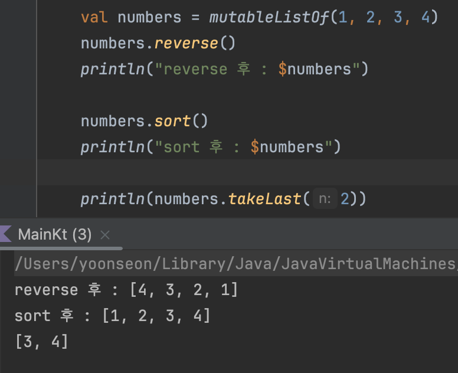
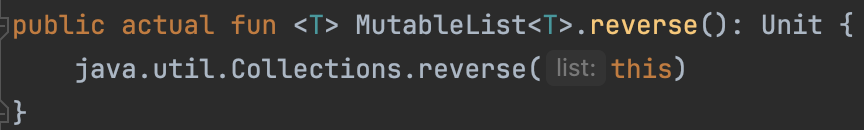
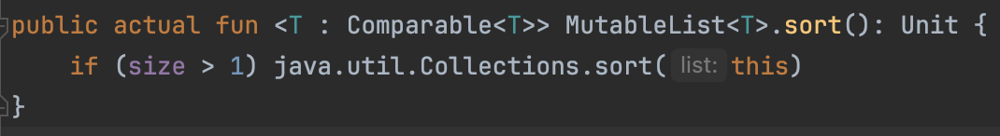
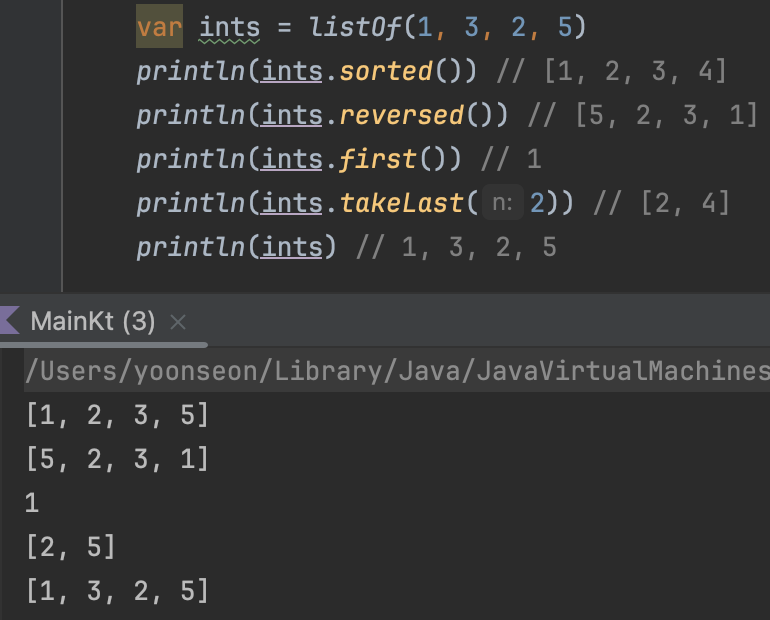
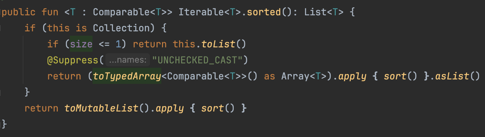
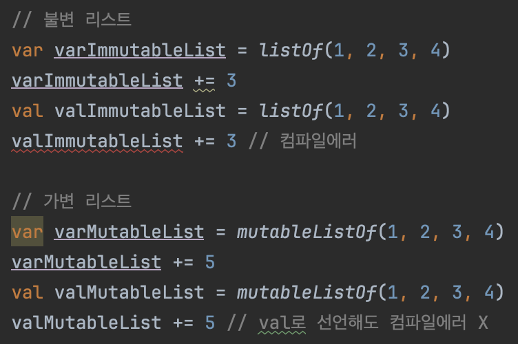
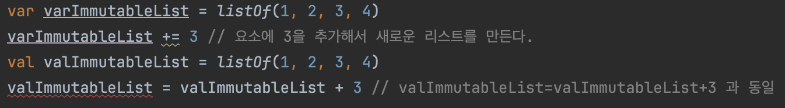
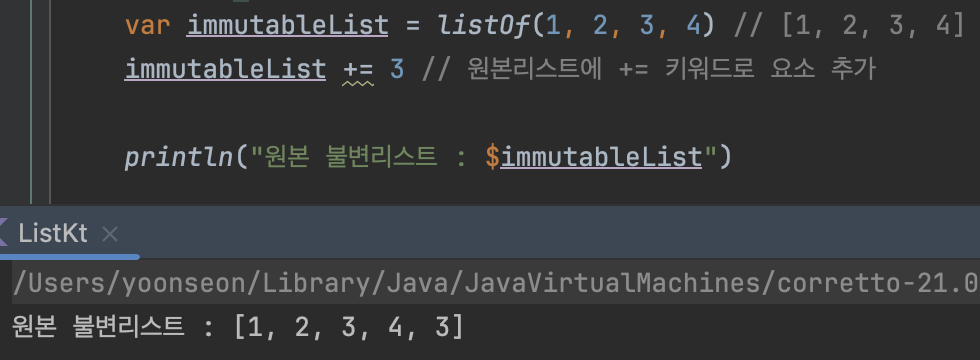
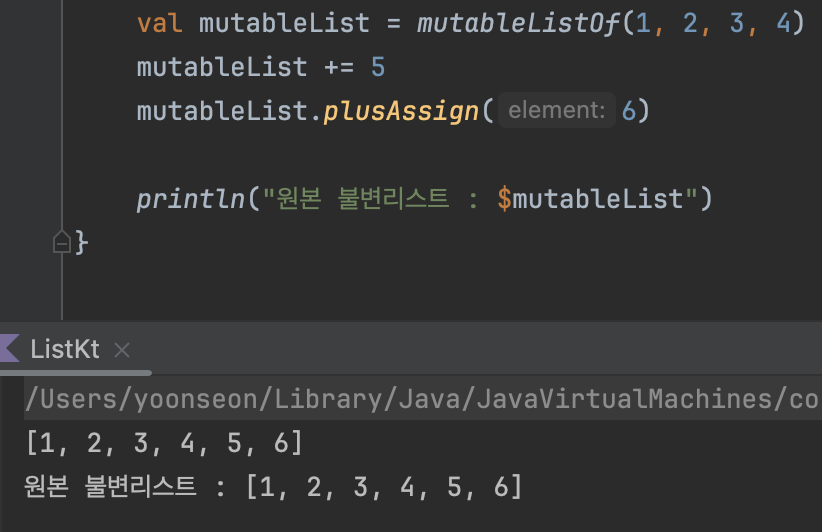
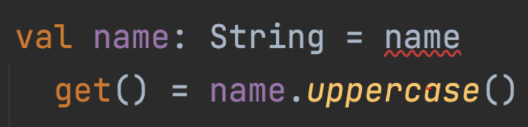

# 객체

객체는 프로퍼티를 사용해 데이터를 저장하고, 함수를 사용해 데이터에 대한 연산을 수행한다.

- 클래스 : 새로운 데이터 타입의 기초가 될 프로퍼티와 함수를 정의
- 멤버 : 클래스에 속한 프로퍼티나 함수
- 멤버 함수 : 함수안에 정의된 함수
- 객체 생성 : 클래스에 해당하는 val이나 var 값을 만드는 과정으로 인스턴스를 생성한다고 한다.

### 형변환

컴파일러가 타입을 임의로 변환할 때 사람들의 혼동을 피하기위해 코틀린은 명시적으로 형변환을 해야한다.

```kotlin
val number = 1 // Int
val toLong = number.toLong() // Long 명시적 형변환
val toDouble = number.toDouble() // Double 명시적 형변환
```

---

# 클래스 만들기

```kotlin
// 클래스를 정의한다.
class Giraffe
class Bear

fun main() {
    // 객체 생성
    val g1 = Giraffe()
    val g2 = Giraffe()
    val b = Bear()
}
```

- 관례적으로 클래스명의 첫 번째 글짜는 대문자로 표기한다.
    - 변수명의 첫 번째 글자는 소문자로 표기한다.

### 맴버 함수와 최상위 함수

```kotlin
class Dog {
    // 맴버 함수
    fun speak() = "멍!"
    fun exercise() = 
            this.speak + "짖는다" // this를 통해 내부 참조 접근
    }
}

// 최상위 함수
fun main() {
    val dog = Dog() 
}
```

- 멤버 함수 : 클래스에 속한 함수
- 최상위 함수 : 클래스에 속하지 않은 함수
- 멤버 함수 안에서는 `this` 를 사용해 객체 내부 참조에 접근할 수 있다.
    - 불필요한 `this`는 코드를 읽는 사람을 헷갈릴 수 있기에 필요한 경우 사용하는것이 좋다.

---

# 프로퍼티

프로퍼티를 정의함으로써 클래스 안에서 **상태를 유지한다.**

- 클래스안에 정의한 `var` 와 `val` 은 클래스의 일부분으로 점 표기법을 사용해서 프로퍼티 값에 접근할 수 있다.
- 맴버 함수는 점 표기법 없이 자신이 속한 객체의 프로퍼티에 바로 접근할 수 있다.

### 최상위 프로퍼티

코틀린에서는 최상위 프로퍼티도 정의할 수 있다.

```kotlin
val a = 1
var b = 2 // 안티패턴

fun inc() {
    b++
}
```

- val은 변경할 수 없으므로 최상위 수준에 val을 정의해도 안전하다.
- `var`는 가변이기 때문에 최상위 프로퍼티로 선언하면 `안티패턴`으로 간주된다. 공유된 가변 상태에 대해 제대로 추론하기 어려워지기 때문이다.

### 객체 참조

- 객체를 생성하면 변수는 객체를 가르키는 참조를 저장한다.
- `val`은 가변이기 때문에 객체의 참조를 가르키는 대상을 다른 대상으로 엮을 수 있지만,
- `val`은 불변이기에 다른 참조를 할당하지 못한다.
- 따라서 객체에서 가변성은 내부 상태를 바꿀 수 있다는 뜻이다.

---
# 생성자

생성자는 새 객체를 초기화하는 멤버함수와 비슷하다.

```kotlin
class Alien(name: String) {
    val greeting = "Poor $name!"
}

fun main() {
    val alien = Alien("Mr. Meeseeks") // 생성자를 통한 객체 생성
}
```

- 기본적으로 생성자 안의 매개변수는 생성자 밖에서 접근이 불가능하다.
- 생성자안에 `val`, `var` 키워드를 붙여준다면 프로퍼티로 간주되어 외부에서도 접근이 가능하다.
    - 프로퍼티 : `field` + `getter` + `setter`
    - `val` 이면 setter는 안만들어준다.

```kotlin
class AlienSpecies(
    val name: String,
    val eyes: Int,
    val hands: Int, // 트레일링 콤마
) {
    fun describe() =
            "$name with $eyes eyes $hands hands"
}
```

- 생성자에는 여러 파라미터가 있을 수 있다.
- 자바랑 다르게 코틀린에서는 `트레일링 콤마`를 허용한다.
    - 트레일링 콤마(Trailing comma) : 여러 요소들을 쉼표(`,`)를 사용하여 나열할 때, 가장 마지막 요소 다음에 오는 쉼표

### toString

디폴트 `toString()`은 객체의 물리적 주소를 출력하며 `toString()`을 직접 정의(override)한다면 직접 정의한 `toString()`이 호출된다.

```kotlin
class ToStringTest() {
    override fun toString(): String {
            return "오버라이딩~"
    }
}
```

- `override` : 코틀린은 자바와 다르게 오버라이드시 `override`키워드를 명시적으로 붙여주어야한다.
    - 자바는 어노테이션으로 표기하며, 어노테이션 생략이 가능했다.

---

# 가시성 제한하기

- 가시성을 제한하기위해 코틀린은 **접근 변경자**를 제공한다.
    - `public`, `protected`, `internal`, `private`
- **접근 변경자**는 클래스, 함수, 프로퍼티 정의 앞에 위치한다.
- `public`은 기본값으로 생략 가능하다. → 명확한 의도를 드러낼 때 public을 가끔 명시한다.
- `private` 로 선언된 클래스, 최상위 함수, 최상위 프로퍼티는 그 정의가 들어가있는 파일 내부에서만 접근 가능하다.
    - `private`은 주로 클래스 멤버에 사용된다.

### private

다른 클래스는 `private` 멤버에 접근할 수 없다.

일례로 라이브러리 개발자는 사용자에게 필요한 함수와 클래스만 외부에 노출시키고 상세 구현은 `private`으로 선언하여 외부에서의 변경을 방지한다.

클래스 내부 필드를 `private`으로 선언하면 **에일리어싱**으로 인한 변경을 방지할 수 있다.

- **에일리어싱 :** 한 객체에 대해 여러개의 참조를 유지하는 것

### 모듈과 internal

- 모듈은 코드 기반상에서 논리적으로 독립적인 각 부분을 의미한다.
    - 빌드 툴(Gradle, Maven)로 모듈 분리 가능하다.
- `internal` 접근 변경자는 해당 모듈 내부에만 접근할 수 있다.
    - `internal` 요소는 라이브러리 내부에서 사용가능하지만, 라이브러리를 소비하는 쪽에서는 접근할 수 없다.
- `public`으로 공개하기에 애매하고, `private`으로 정의하자니 제약이 심하다고 느껴질 때 `internal`을 사용하여 모듈내에서만 접근 가능하도록 사용하는 것을 권장한다.

---

# 패키지

패키지는 연관있는 코드를 모아둔 것이다. 각 패키지는 보통 특정 문제를 풀기위해 고안되며, 여러 클래스와 함수를 포함한다.

- `import` 키워드로 다른 파일에 정의된 코드를 사용할 수 있다.
- `as` 키워드를 통해 import에 별칭을 줄 수 있다.(클래스 및 정적 팩토리 메서드에도 가능)
    - `as` 는 라이브러리 이름이 너무길 때 유용하다.

```kotlin
import kotlin.math.PI as circleRatio // 정적 팩토리 메서드에 별칭
import kotlin.math.cos as cosine

fun main() {
    println(circleRatio)
    println(cosine(circleRatio))
    println(cosine(2 * circleRatio))
}
```

### 코틀린에서는 자바와 달리 파일명과 클래스명이 달라도 된다.

항상 클래스 이름과 같아야 하는 자바와 달리, 코틀린에서는 소스 코드 파일 이름으로 아무 이름이나 붙여도 좋다.

패키지 이름도 아무 이름이나 선택할 수 있다.

하지만 패키지 이름과 패키지 파일이 들어 있는 경로를 똑같이 하는게 좋은 스타일로 여겨진다.

---

# 예외

### 체크 예외와 언체크 예외

```java
// 자바
public void readFile() throws IOException { // 예외 전파
    File currentFile = new File(".");
    File file = new File(currentFile.getAbsolutePath() + "/a.txt");
    BufferedReader reader = new BufferedReader(new FileReader(file));
    System.out.println(reader.readLine());
    reader.close();
}
```

```kotlin
// 코틀린
fun readerFile() {
    val currentFile = File(".");
    val file = File(currentFile.getAbsolutePath() + "/a.txt");
    val reader = BufferedReader(new FileReader(file));
    println(reader.readLine());
    reader.close();
}
```

회복이 불가능한 체크예외를 자바에서는 처리(`throws`)해야하지만, 코틀린에서는 처리하지 않아도 된다.

**코틀린은 체크예외와 언체크예외를 구분하지않는다! =** 모두 언체크예외로 **간주**된다.

### 코틀린 + 스프링에서 체크예외가 발생하면 트랜잭션은 어떻게 처리될까?
- **코틀린에서는 예외를 체크 예외와 언체크 예외로 구분하지 않지만**, Spring 트랜잭션 관리자는 자바의 예외 구분을 따른다.
- 해당 예외가 Kotlin으로는 Unchecked Exception으로 간주되더라도, 실제 트랜잭션의 롤백은 Java에서의 checked exception, unchecked exception을 따라가기 때문에 RuntimeException을 상속받지 않았다면(체크예외라면) 롤백되지 않는다.
- 참고로 체크예외는 서비스 단에서 본 적이 거의 없다. 그 이유는 checked exception 중 가장 흔한 case인 IOException을 Transaction에서 격리하는 것이 좋기 때문.
    - 격리해야하는 이유는 커넥션풀 때문
> **[참고자료]**
> - [코틀린으로 작성된 스프링 기반 API 트랜잭션 rollback 관리](https://yeongcheon.github.io/posts/2020-09-06-kotlin-spring-exception-rollback/)
> - [스프링에서의 트랜잭션 롤백처리 관련해서 질문 드립니다 - 인프런](https://www.inflearn.com/questions/582545/스프링에서의-트랜잭션-롤백처리-관련해서-질문-드립니다)

---
# 리스트 - List

```kotlin
val ints = listOf(1, 2, 3, 4) // [1, 2, 3, 4]

// List 각 요소 이터레이션
for (i in ints) {
    result += "$i"
}

// 각 원소에 인덱스를 통해 접근
val number = ints[3] // 4
```

- List는 자기 자신을 표현할 때 각괄호 `[]` 를 사용한다
- 코틀린에서도 향상된 for문을 사용할 수 있다.
    - `in` 을 사용하여 각 원소에 접근한다.
- 자바와 다르게 코틀린에서는 배열과 인덱스 접근(`[]`) 동일하게 리스트 요소에 접근한다.

## 가변리스트와 불변리스트

코틀린은 불변리스트와 가변리스트를 생성시점에 결정한다.

- `listOf()` : 불변 리스트를 반환한다.
- `mutableListOf()` : 가변 리스트를 반환한다.
    - 리스트를 점진적으로 만든다면 `mutableListOf()` 를 사용해야한다.

```kotlin
// 불변리스트 생성
val immutable = listOf(1, 2, 3, 4) // [1, 2, 3, 4]
// 가변리스트 생성
val mutable = mutableListOf(5, 6, 7, 8) // [5, 6, 7, 8]
```

## 리스트 확장함수

- **인플레이스 변경 (In-place Modification)**: 기존 변수를 직접 수정하여 데이터 구조를 변경하는 방식

### 가변 리스트

```kotlin
val numbers = mutableListOf(1, 2, 3, 4)
numbers.reverse()
numbers.sort()
numbers.takeLast()
```

- `sorted()` : 해당 리스트를 정렬한다.
- `revered()` : 해당 리스트를 역순으로 재정렬한다.
- `first()` : 리스트의 첫번째 요소를 반환한다.
- `taskLast(<숫자>)` : 리스트 마지막요소에 인자의 크기만큼 잘라서 반환한다.

### 가변리스트의 연산 관련 함수는 리스트를 직접 변경한다. → 인플레이스




- 가변 리스트에 `reverse`, `sort` 함수를 호출하면 해당 리스트가 조작된다.
- `sort`와 `reverse` 함수 구현체를 보면 실제로 반환타입 없다.
- java의 `Collections` 패키지의 메서드를 호출해서 인플레이스 한다.

### 불변 리스트

```kotlin
var ints = listOf(1, 3, 2, 5)
println(ints.takeLast(2)) // 2, 4
println(ints.sorted()) // 1, 2, 3, 4
println(ints.first()) // 1
println(ints) // 1, 3, 2, 5 
```

- `sorted()` : 해당 리스트를 정렬한 새로운 리스트를 만들어서 반환한다.
- `revered()` : 해당 리스트를 역순으로 뒤집은 새로운 리스트를 만들어서 반환한다.
- `first()` : 리스트의 첫번째 요소를 반환한다.
- `taskLast(<숫자>)` : 리스트 마지막요소에 인자의 크기만큼 잘라서 반환한다. → 가변 리스트와 동일
- 불변리스트의 요소를 조작하는 확장함수에는 과거형인 `ed` 가 붙는다!
  - 실제로 구현체를 보면 불변리스트는 직접 수정이 불가능하기 때문에 가변 리스트에 복사해서 가변리스트를 조작한 후 반환한다.

### 불변리스트의 연산 관련 함수는 리스트를 복사한후 변경하고 새로운 리스트를 반환한다.

  




- 불변 리스트에 reverse, sort 함수를 호출하면 해당 리스트가 조작되지 않는다.
- `sort`와 `reverse` 함수 구현체를 보면 가변 리스트에 복사해서 가변리스트를 조작한 후 반환한다.
- 반환타입이 있다 → 새로운 리스트를 반환한다.

## +=의 비밀

`val`, `var` 로 선언된 가변 리스트에 `+=` 연산자를 사용하면 리스트에 요소를 추가할 수 있다.  
불변리스트는 `var`로 선언되어야 `+=` 연산자로 리스트에 요소를 추가할 수 있다.  
`var`로 선언된 불변 리스트에 `+=` 연산자를 사용하면 리스트에 요소를 추가할 수 있다.

  

- `var` 로 선언된 불변 컬렉션에 `+=` 를 붙이면 요소를 추가할 수 있다.
- `val` 로 선언된 불변 컬렉션에 `+=` 를 붙이면 컴파일 에러가 발생한다.

### 불변 리스트에서 += 동작 방식



- 불변 리스트에서 `+=` 연산자는 기존 불변리스트에 새로운 요소를 추가한 새로운 요소를 반환한다.
- `valImmutableList = valImmutableList + 3` 은 `valImmutableList=valImmutableList+3`과 동일하다.
- 불변인 `val`로 선언 되었을 경우 값을 다시 할당할 수 없어 컴파일 에러가 발생하게 되는 것 이다.



- 불변 리스트는 한 번 생성된 후에는 그 상태를 변경할 수 없다.
- `+=` 연산자는 새로운 리스트를 생성하여 변수가 참조하는 대상을 변경한다.
- 따라서 `immutableList += 3`에서는 실제로 새로운 리스트가 생성되어 할당되고, 이 과정에서 이전에 참조하던 리스트와는 다른 객체를 참조하게 된다.

### 가변 리스트에서 += 동작 방식



- 가변 리스트는 리스트 자체가 요소 수정이 가능하다.
- 가변리스트에 `+=` 연산자를 사용하면 코틀린 컴파일러가 `+=` 를 `plusAssign`으로 변경하여 요소를 추가해준다. 따라서 `val`, `var` 는 상관없다.
  - `plusAssign` : 가변리스트에 요소를 `add` 한다.

---

# 가변 인자 목록

자바와 같이 코틀린에서도 가변인자를 함수의 매개변수로 받을 수 있다.

```java
public static void printAll(String... strings) {
    for (String str : strings) {
            System.out.println(str);
    }
}

// 아래와 같이 사용
public void static main(String[] args) {
    printAll("A", "B", "C");
}
```

- 자바는 `…` 을 사용하여 가변인자를 나타내며, 가변인자는 배열로 받아진다.

```kotlin
fun printAll(vararg strings: String) {
    for (str in strings) { // 가변인자 변수는 배열로 취급
            println(str)
    }
}

fun main() {
    printAll("A", "B", "C") // 자바와 동일하게 사용 가능
    val array = arrayOf("D", "F")
    
    printAll(*array) // 스프레드 연산자를 사용해야 배열 자체를 전달 가능하다.
}
```

- 코틀린은 `vararg` 을 사용하여 가변인자를 나타낸다.
- 가변인자 변수는 배열로 취급된다. → 배열은 항상 가변 객체임을 주의
- 배열 자체를 전달할 때는 `*` (스프레드 연산자)를 사용한다.

---

# 집합 - Set

- Set은 List와 다르게 순서가 없고 중복을 허용하지 않는다.
- 자료구조적 의미를 제외하면 모든 기능이 List와 비슷하다.
- List에서 중복을 제거하려면 Set으로 변환하거나, List를 반환하는 `distinct()`를 사용할 수 있다.
- `mutableSetOf` 를 사용하여 가변 집합을 생성한다.
- `setOf`, `mutableSetOf` 의 기본 구현체는 `LinkedHashSet` 이다.

  [setOf,mutableSetOf 기본 구현체가 LinkedHashSet이면 - 인프런](https://www.inflearn.com/questions/833438/setof-mutablesetof-기본-구현체가-linkedhashset이면)

  > 요약 : `setOf()` 가 가리키는 `Set`의 구현타입이 코틀린 라이브러리 상에서 혹시 변경될 수도 있으니, 만약 '순서보장' 로직이 반드시 요구되는 `Set`이 필요하다면, `LinkedHashSet` 또는 순서보장 집합 코드를 그대로 사용하는 것도 방법이다.


---

# 맵 - Map

### 맵 생성

**자바**

```java
// JDK 8까지
Map<Integer, String> map = new HashMap<>();
map.put(1, "월요일");
map.put(2, "화요일");

// JDK 9부터
Map.of(1, "월요일", 2, "화요일");
```

**코틀린**

```kotlin
val oldMap = mutableMapOf<Int, String>()
oldMap[1] = "월요일"
oldMap[2] = "화요일"

mapOf(1 to "월요일", 2 to "화요일") // 중위호출
```

- 코틀린은 `맵[key] = value` 와 `mapOf`를 통해 맵을 초기화할 수 있다.
- `mutableMapOf` 과 `mapOf` 은 Map에 전달된 순서를 보장해준다.(다른 맵 타입은 보장되지 않을 수 있음)
- `mutableMapOf` : 가변 맵
- `mapOf` : 불변 맵

### 맵 순회

**자바**

```java
// key를 가져오고 key를 통해 value 접근
for (int key : map.keySet()) {
		System.out.println(key);
		System.out.println(map.get(key));
}

// entry로 접근
for (Map.Entry<Integer, String> entry : map.entrySet()) {
		System.out.println(entry.getKey());
		System.out.println(entry.getValue());
}
```

**코틀린**

```kotlin
// entry로 접근
for ((key, value) in oldMap.entries) { // oldMap.entries는 Map.Entry<K, V> 구조
		println(key)
		println(value)
}

// 이 방법은 내부적으로 entrySet()을 호출
for ((key, value) in oldMap) { // oldMap은 Map<K, V> 구조
		println(key)
		println(value)
}

for (entry in oldMap) {
    println("${entry.key} -> ${entry.value}")
}
```

- `mutableMapOf` 를 사용하여 가변 맵을 만들 수 있다.
- 코틀린에서도 정적 팩토리 메서드로 바로 만들 수 있다.

### 맵 조회

- 주어진 키에 해당하는 원소가 포함되어 있지 않으면 Map은 `null` 을 반환한다.
- `null`이 될 수 없는 결과를 원한다면 `getValue()`를 사용할 수 있다.
  - `getValue()` 를 사용했을 때 키가 맵에 들어있지 않으면 `NoSuchElementException`이 발생한다.

## + 연산자

### 불변 맵에 + 연산자 사용

```kotlin
fun main() {
    val map1 = mapOf(
        "key1" to 1,
        "key2" to 2
    )

    val map2 = mapOf(
        "key3" to 3,
        "key4" to 4
    )

    val combinedMap = map1 + map2

    println(combinedMap) // {key1=1, key2=2, key3=3, key4=4}
}
```

- 불변 Map에  `+`  연산자를 사용하면 기존 맵의 원소와 더해진 원소를 포함하는 새로운 Map을 만들 수 있다. → 원래 Map에는 영향 X
- 불변 Map에 새로운 원소를 추가하는 유일한 방법은 새로운 Map을 만드는 것이다.

### 가변 맵에 + 연산자 사용

```kotlin
fun main() {
    val map1 = mutableMapOf(
        "key1" to 1,
        "key2" to 2
    )

    val map2 = mapOf(
        "key3" to 3,
        "key4" to 4
    )

    map1 += map2

    println(map1) {key1=1, key2=2, key3=3, key4=4}
}
```

- `+=` 연산자를 사용하여 `map1`에 `map2`의 요소들을 추가할 수 있다
- `map1`에는 두 맵의 모든 요소가 합쳐진 결과가 저장된다.

---

# 프로퍼티 접근자

코틀린에서는 생성자에 바로 필드를 선언하면 프로퍼티가 만들어진다.

- 프로퍼티 : 필드 + getter + setter

```kotlin
class Data(
    var i: Int,
)

fun main() {
    val data = Data(10)
    println(data.i) // getter
    data.i = 20 // setter
}
```

생성자에 바로 필드를 초기화하지 않고 클래스 멤버안에 필드를 선언하고, 프로퍼티를 커스텀할 수 있다.

```kotlin
class Default {
    var i: Int = 0
        get() {
                return field
        }
        set(value) {
                field = value
        }
}

fun main() {
    val d = Default()
    println(d.i) // getter
    d.i = 2 // setter
}
```

- `get()`, `set()` 의 순서는 중요하지 않으며 둘 중 하나만 정의해도 무방하다.
- `get()`, `set()` 내부의 `field` 예약어는 getter, setter 안에서만 접근 가능한 이름이다.

프로퍼티를 `private`으로 정의하면 두 접근자 모두 `private`이 된다.

```kotlin
class Counter {
    var value: Int = 0
        private set
        
    fun inc() = value++
}

fun main() {
    val counter = Counter()
    counter.inc()
}
```

## 💡 field 예약어를 사용하지 않고 바로 접근할 경우 무한루프가  발생한다.


- `field`를 통해 getter가 가르키는 Backing field에 접근할 수 있다.

### Backing field


위와 같이 `field`가 아닌 **프로퍼티명을 직접 입력할 경우 프로퍼티에 대한 getter가 호출**된다.  
name을 호출하면 name의 getter가 호출되고 name의 getter안에 name이 다시 getter를 호출해서  **무한 루프가 발생**한다.  
따라서 무한루프를 막기위해 `field` 키워드를 사용하여 이 backing field에 접근해야한다.  
하지만 실무에서 Backing field를 사용하는 일은 드물다고한다.  
아래와 같이 처리할 수 있기 때문  

```kotlin
// 함수로 직접 만들어서 제공
fun getUppercaseName(name: String): String {
		return this.name.uppercase()
}

// 프로퍼티로 제공
val uppercaseName: String
		get() = this.name.uppercase() // this를 불여서 getter가 아닌 필드에 직접 접근
```

## 💡 엔티티는 어떻게 설계해야할까 - 토론해보기

https://www.youtube.com/watch?v=QlhQ4fcO3l4