# ✅ 확장 함수

확장 함수는 어떤 클래스 안에 있는 메서드처럼 호출할 수 있지만, 함수는 밖에 만들어서 마치 클래스 안에 있는 맴버함수 처럼 호출해서 사용할 수 있다.

즉, 기존 클래스에 맴버 함수를 추가하는 것과 같은 효과를 낸다.

이때, 확장할 대상 타입(클래스)은 **수신 객체 타입(receiver type)** 이라고 하며, 확장 함수를 정의하기 위해서는 함수 이름 앞에 수식 객체 타입을 붙여야 한다.

```kotlin
fun 수신타입.확장함수() { ... }
```

다음과 같이 String 클래스 확장 함수를 정의하고 사용할 수 있다.

```kotlin
// String 클래스 안에 있는 것과 같은 확장함수
fun String.lastChar(): Char {
    return this[this.length-1]
}
```


- 확장함수를 마치 수신객체 타입의 멤버 함수인 것처럼 호출할 수 있다.   


실제로 IDE에서 확장함수를 일반 함수처럼 추천해준다.   
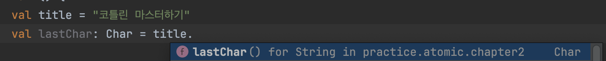


### this로 멤버 함수나 다른 확장에 접근 가능하다.

- 클래스 내부에서 `this`를 생략할 수 있었던 것 처럼 확장함수에서도 this가 생략 가능하다.
- 확장함수의 `this`는 **수신 객체**를 의미한다.

```kotlin
fun 확장하려는클래스.함수이름(파라미터): 리턴타입 {
    // this를 이용해 실제 클래스 안의 멤버에 접근
}
```

아래와 같이 생성 가능하다.

```kotlin
fun String.substringLastChar(): String {
    return substring(0, this.length - 1)
}

fun String.doubleSubstringLastChar() =
    this.substringLastChar().substringLastChar()
 // substringLastChar().substringLastChar() // this 생략 가능
```

### 확장 함수는 수신객체 타입의 public 원소에만 접근할 수 있다.

- 확장은 일반 함수가 할 수 있는 일만 처리할 수 있다.
- 즉, 확장 함수가 `public`이고 확장 함수에서 수신객체타입의 `private` 함수를 가져오면 캡슐화가 깨지기 때문에 확장 함수는 `private`, `protected` 맴버를 가져올 수 없다.

### 확장함수명과 메서드 시그니처와 동일한 경우
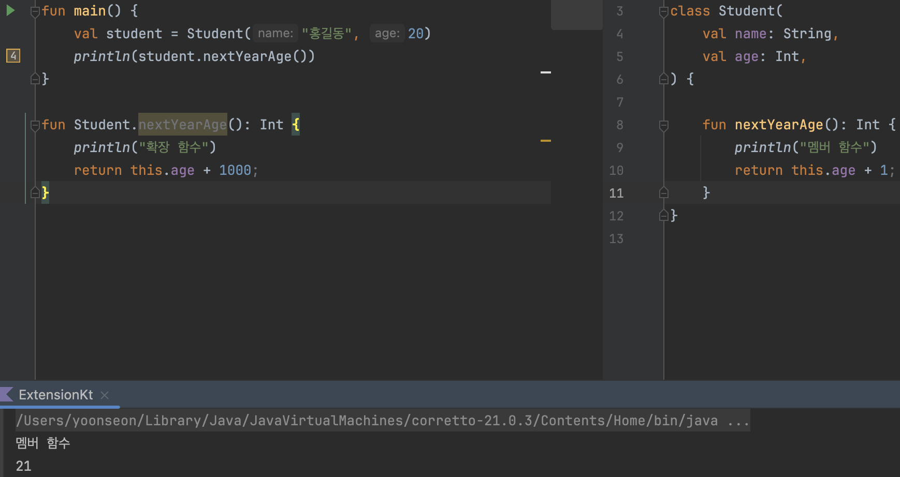

- 맴버함수가 우선적으로 호출된다.
- **🔥 따라서 확장함수를 만들었지만, 다른 기능의 똑같은 멤버 함수가 생긴다면 오류가 발생할 수 있다.**

### 확장 함수를 사용하는 이유

- 확장 함수는 사용하는 이유는 오로지 this를 사용함으로써 구문적 편의를 얻기 때문이다.
- 확장 함수를 호출하는 코드에서 확장 함수는 멤버 함수와 똑같아 보이고, IDE에서는 객체에 대해 점 표기법으로 호출할 수 있는 함수 목록에 확장을 포함시켜준다.

---

# ✅ 이름 붙은 인자와 디폴트 인자

## NamedArgument

이름 붙은 인자를 사용해서 인자의 이름을 명시할 수 있다.  
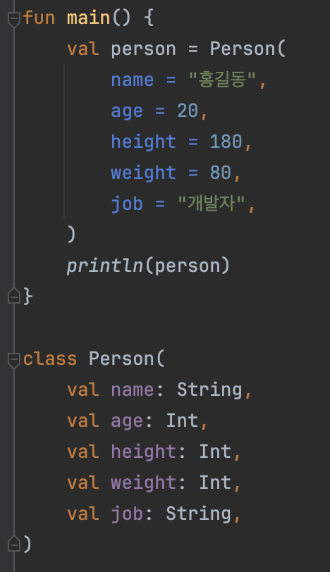

- NamedArgument를 사용하면 코드를 읽는 사람이 함수에 대한 문서를 살펴보지 않아도 코드를 이해할 수 있을 정도로 코드가 명확해진다.
- NamedArgument는 함수 인자 순서를 변경할 수 있다.
    - NamedArgument로 인자 순서를 변경했다면 나머지 인자 순서도 변경해야한다.(컴파일러가 뭐가 뭔지 모르기 때문)


## DefaultArgument

디폴트 인자란 파라미터의 디폴트 값을 함수에서 정의하는 것을 말한다.
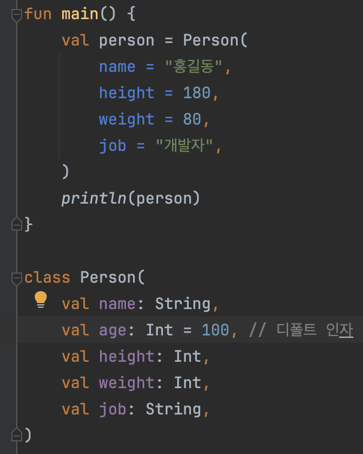

- 디폴트 인자가 지정된 함수는 값을 지정하지 않을 경우 자동으로 디폴트 값이 지정된다. 따라서 디폴트 값과 다른 인자만 지정하면된다.
- 🔥 NamedArgument + DefaultArgument 조합을 사용하면 롬복의 Builder와 동일한 효과를 낼 수 있다.

### DefaultArgument를 객체로도 지정할 수 있다.

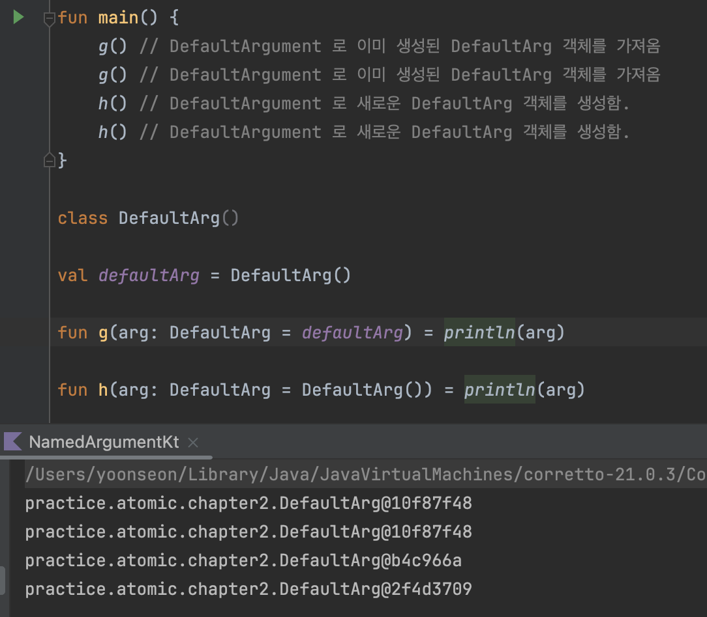

---

# ✅ 오버로딩

디폴트 인자를 흉내 내기 위해 확장함수를 사용하면 안된다.

즉, 다음과 같은 코드는 작성하지 말아야한다.

```kotlin
fun f(n: Int) = n + 373
fun f() = f(0)

fun main() {
	println(f() == 373) // true
}
```

위 코드는 디폴트 인자를 사용해 개선할 수 있다.

```kotlin
fun f(n: Int = 0) = n + 373
```

함수 오버로딩과 디폴트 인자를 함께 사용하는 경우, 오버로딩한 함수를 호출하면 함수 시그니처와 함수 호출이 가장 가깝게 일치되는 함수를 호출한다.

### 오버로딩이 유용한 이유

오버로딩을 사용하면 `같은 주제를 다르게 변경한다`는 개념을 강제로 서로 다른 함수명을 써야 할 경우보다 더 명확하게 표현할 수 있다.

```kotlin
fun addInt(i: Int, j: Int) = i + j
fun addDouble(i: Double, j: Double) = i + j

// 위 함수를 오버로딩으로 개선
fun add(i: Int, j: Int) = i + j
fun add(i: Double, j: Double) = i + j
```

- 오버로딩이 있으면 가치가 있는 단순성을 얻을 수 있어서 더 읽기 좋은 코드를 작성할 수 있게 된다.

---

# ✅ when 식

`when` 문은 어떤 값을 여러 가지 가능성과 비교해 선택한다. 자바에서 `switch` 문이 코틀린에서 `when` 문으로 대체되었다고 할 수 있으며 `switch`문 보다 더 강력한 기능을 갖는다.

`when`문 사용법

- `when`으로 시작하고
- `when` 뒤에는 괄호 안에 있는 비교 대상 값이 오고
- 그 뒤에는 값과 일치할 수 있는 여러 매치가 들어있는 본문이온다.
- 각 매치는 식, 오른쪽 화살표(`→`)로 시작한다.
- 화살표(`→`) 오른쪽에는 결괏값을 계산하는 식이온다.

when의 인자로는 임의의 식(list나 set과 같은)이 올 수 있다.

```kotlin
val yes = "Y"
val no = "N"

// 값 비교
for (choice in listOf(yes, no, yes)) {
    when (choice) {
	      yes -> println("맞다.")
	      no -> println("아니다.")
    }
    
    // 위 식을 if문으로 나타내면
    if (choice == yes) println("맞다.")
	  else if (choice == no) println("아니다.")
}

// set 비교
fun mixColors(first: String, second: String) {
    when (setOf(first, second)) {
		    setOf("red", "blue") -> "purple"
		    setOf("red", "yellow") -> "orange"
    }
}

// 조건 비교
fun compareNumber(i: Int, j:Int) {
    when {
        i > j -> println("$i 가 $j 보다 더 크다.")
        i < j -> println("$i 가 $j 보다 더 작다.")
        i == j -> println("$i 와 $j 는 같다.")
    }
}
```

---

# ✅ Enum

자바의 Enum과 동일하다.

```kotlin
enum class Level {
	Overflow,
	High,
	Medium,
	Low,
	Empty
	; 
}
```

enum은 인스턴스 개수가 미리 정해져 있고 클래스 본문에 이 모든 인스턴스가 나열되 있는 특별한 종류의 클래스다.

이 점을 제외하면 enum은 일반 클래스와 똑같이 동작하기 때문에 멤버 함수나 멤버 프로퍼티를 정의할 수도 있다.

추가 멤버를 정의하기 위해서는 마지막 enum 값 다음에 세미콜론(`;`)을 꼭 붙여야한다.(자바와 동일)

```kotlin
enum class Direction(
    val notation: String
) {
    NORTH("N"),
    SOUTH("S"),
}

```

- 일반 생성자를 호출할 때 처럼 괄호를 사용해 생성자 인자를 전달하면 notation에 값을 전달할 수 있다.
- enum은 자바와 같이 인스턴스 생성이 불가능하며 위 생성자는 enum 내부 프로퍼티에 값을 전달하기 위한 용도로 쓰인다.

---

# ✅ 데이터 클래스

데이터 저장만 담당하는 클래스가 필요하다면 data 클래스를 사용해서 코드양을 줄이고 여러가지 공통 작업을 편하게 수행할 수 있다.

data 클래스를 정의할 때는 `data` 키워드를 사용 하며 모든 생성자 파라미터를 `var`나 `val`로 선언해야한다.


- val / var를 생성자 파라미터에 정해주지 않아 컴파일 에러가 발생한다.

data 클래스는 toString(), hashCode(), equals(), copy()를 자동으로 만들어준다.

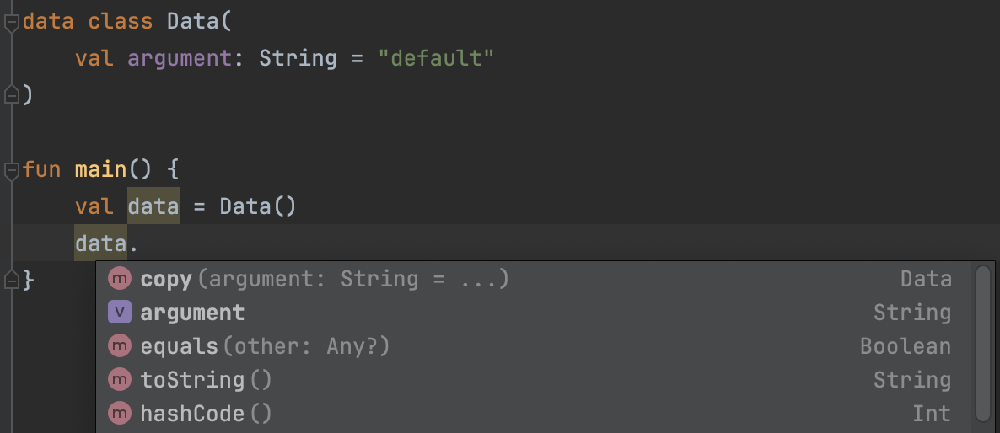

- equels()는 생성자 파라미터에 열거된 모든 프로퍼티가 같은지 검사하는 식으로 구현된다.
- copy()는 현재 객체의 모든 데이터를 포함하는 새 객체를 생성해준다.
  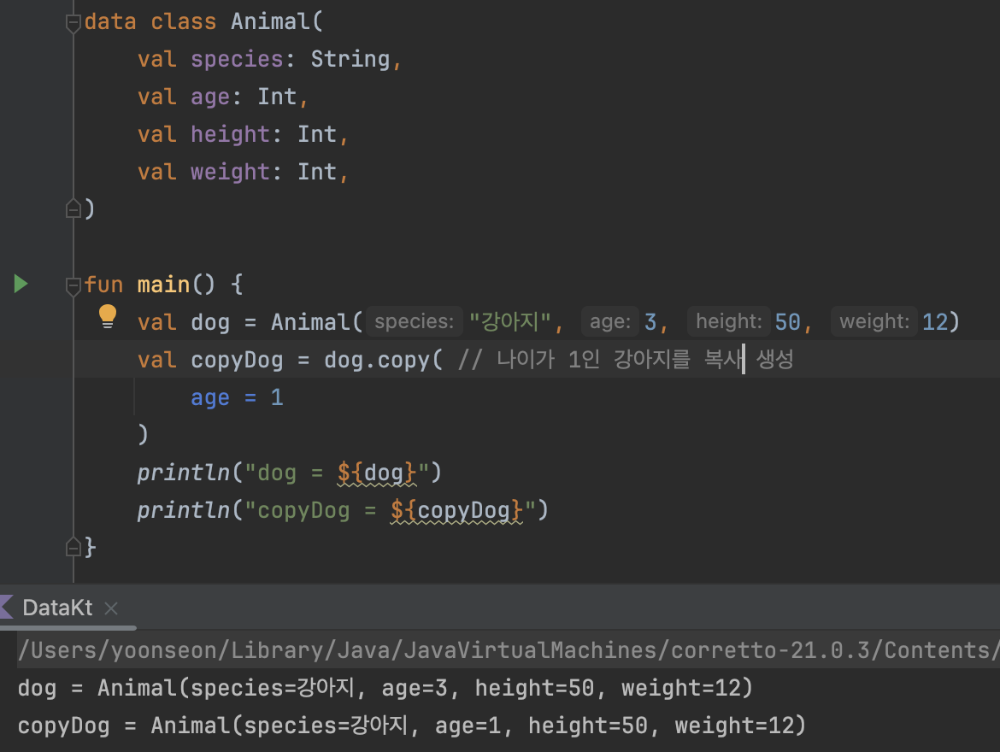
  - 모든 인자에는 각 프로퍼티의 현재 값이 디폴트 인자로 지정되어 있고, 변경하고 싶은 인자만 NamedArgument로 지정하면 된다.

---

# ✅ 구조 분해 선언
표준 라이브러리에 있는 Pair, Triple 클래스를 사용하면 여러 값을 반환할 수 있다.

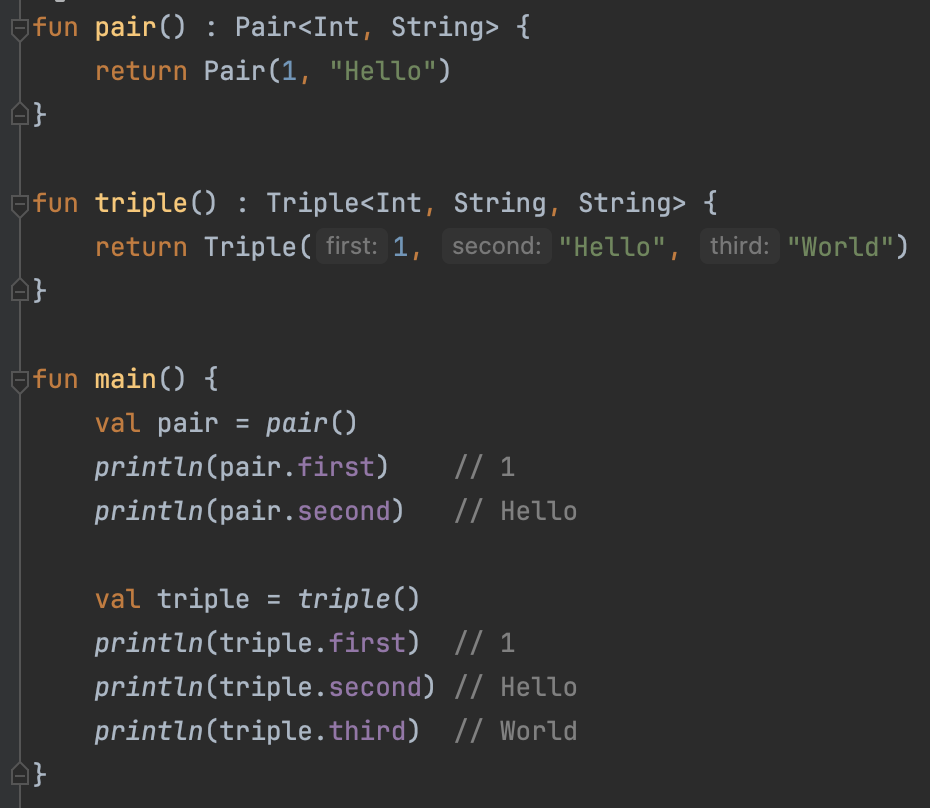

- Pair 클래스의 인스턴스는
  - `first` : 첫 번째 element
  - `second` : 두 번째 element
- Triple 클래스의 인스턴스는
  - `first` : 첫 번째 element
  - `second` : 두 번째 element
  - `third` : 세 번째 element

🔥 Pair, Triple 클래스를 사용하여 여러 값을 반환하면 편리하지만, 구조 분해 선언을 사용하면 여러 식별자를 동시에 선언하면서 초기화 할 수 있다.

```kotlin
val (a, b, c) = 여러_값이_들어있는_값
```

아래와 같이 사용이 가능하다.

```kotlin
fun compute(input: Int): Pair<Int, String> {
    val description = "${input.toString()} 입니다."
    return Pair(input, description)
}

fun main() {
    val (value, toString) = compute(1) // 구조분해 문법
    println(value)    // 1
    println(toString) // 1 입니다.
}
```

코틀린에서는 Pair, Triple 클래스까지만 지원한다. 더 많은 값을 저장하고 싶다면 각 상황에 맞는 클래스를 만들어서 반환해야한다.

### data 클래스의 구조 분해 선언

data 클래스는 자동으로 구조 분해 선언을 지원한다.

data 클래스의 인스턴스를 구조 분해할 때는 data 클래스 생성자에 각 프로퍼티가 나열된 순서대로 값이 대입된다.

```kotlin
data class Computation(
    val data: Int,
    val info: String,
)

fun main() {
    val (data, info) = Computation(1, "숫자 1이다.")
    println(data) // 1
    println(info) // "숫자 1이다."
}
```

> *여러 값을 반환해야할 때 Pair, Triple 클래스를 반환하는 것보다 의미가 담긴 클래스를 반환하는 것이 더 좋은 코드를 작성하는 방법이다.*
>

### 구조분해가 동작하는 방식

- Data Class를 생성하면 코틀린은 기본적으로 componentN이라는 함수를 자동으로 만들어준다.
- 데이터 클래스는 기본적으로 자기가 가지고 있는 필드를 만들어주는데, 예를들어 `component1` 은 첫 번째 프로퍼티를 가져오고 `component2`는 두 번째 프로퍼티를 가져온다.

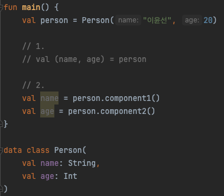

- 1번과 2번은 같은 코드다.
- 따라서 아래의 구조분해 문법을 쓴다는 것은 componentN 함수를 호출한다는 뜻이다.

### Data Class가 아닌데 구조분해 문법을 사용하고 싶은 경우

- Data Class가 아닐 때 구조분해 문법을 사용하려면 componentN 함수를 직접 구현하여 사용할 수 있다.
  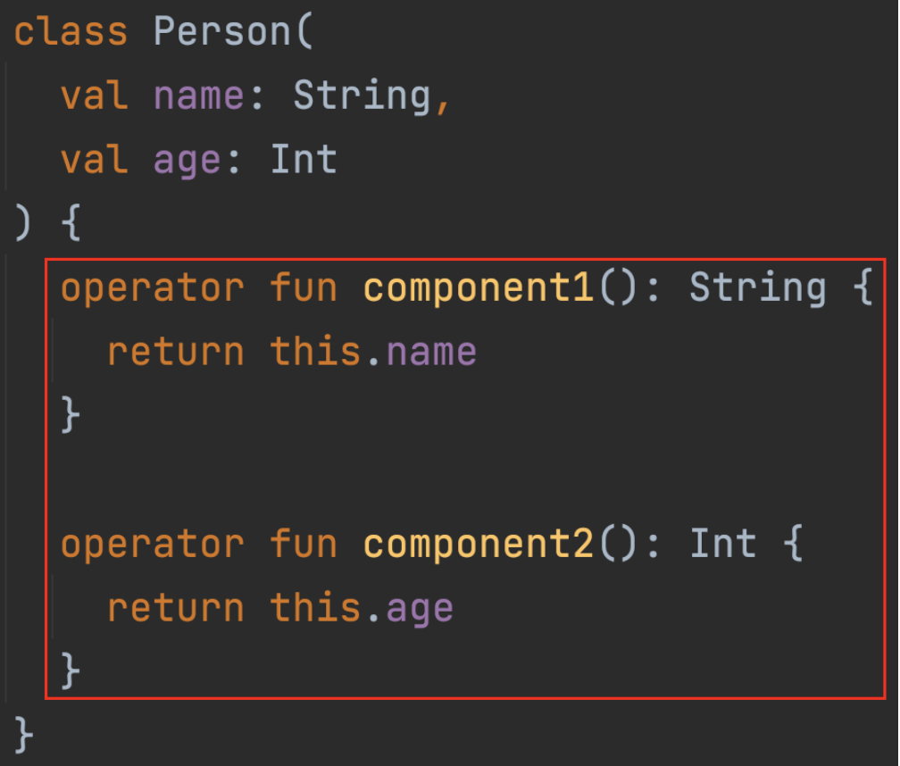
- componentN 함수는 연산자의 속성을 가지고 있기 때문에 연산자 오버로딩을 하는 것처럼 간주되야 한다.
- 따라서 앞에 `operator` 키워드를 붙여준다.

### data 클래스의 인스턴스를 구조분해로 사용할 때 주의점

data 클래스의 프로퍼티는 이름에 의해 대입되는 것이 아니라 순서대로 대입된다.

어떤 객체를 구조 분해에 사용했는데 이후 그 data 클래스에서 맨 마지막이 아닌 위치에 프로퍼티를 추가하는 경우 새 프로퍼티가 기존에 다른 값을 대입받던 식별자에 대입되면서 예상과 다른 결과를 낳을 수 있다.

- **예시**

  예를 들어, 처음에는 `Person` 클래스가 다음과 같이 정의되어 있었다고 가정

    ```kotlin
    data class Person(
        val name: String,
        val info: String,
    )
    ```

  그리고 기존에 다음과 같이 구조 분해를 사용했다고 가정

    ```kotlin
    val (name, info) = person
    ```

  이후에 `Person` 클래스에 새로운 프로퍼티 `address`를 마지막이 아닌 위치에 추가한다면

    ```kotlin
    data class Person(
        val name: String,
        val address: String, // 마지막이 아닌 위치에 추가
        val info: String,
    )
    ```

  이 경우, 기존의 코드는 `name`과 `info` 변수에 각각 `name`과 `address` 프로퍼티의 값을 할당받게 된다.

    ```kotlin
    val (name, info, address) = person // age 변수에 address의 값이 들어감
    ```

  **따라서 `info` 변수에 `address` 가 들어가서 예상치 못한 결과를 낳게 된다.**

  추가된 프로퍼티 타입과 원래 그 위치에 있던 프로퍼티 타입이 다르면 컴파일러는 이 문제를 감지하지만, **프로퍼티 타입이 같다면 컴파일러는 이 문제를 감지하지 못한다.**

  - Pair나 Triple 같은 라이브러리가 제공하는 data 클래스는 프로퍼티 순서가 바뀌지 않으므로 구조 분해에도 안전하다.
  - 🔥 여러 값을 반환해야할 때 Pair, Triple 클래스는 구조 분해에 안전하지만, 의미가 담긴 클래스를 반환하는 것이 더 좋은 코드를 작성하는 방법이다. 의미가 담긴 클래스에서 구조 분해를 주의해서 사용한다면 단점을 보완할 수 있을 것이다.

### 표준 라이브러리의 구조 분해 예시

`withIndex()`는 표준라이브러리가 List에 대해 제공하는 확장함수다.  
이 함수는 컬렉션의 값을 IndexedValue 라는 타입의 객체에 담아서 반환한다.

```kotlin
fun main() {
    val list = listOf("a", "b", "c")
    for ((index, value) in list.withIndex()) {
        println("$index: $value")
    }
}

// 출력
// 0: a
// 1: b
// 2: c
```
<br>
1장에서 배웠던 map을 entries 형태로 key, value를 동시에 가져오던 것도 구조분해 문법이다.

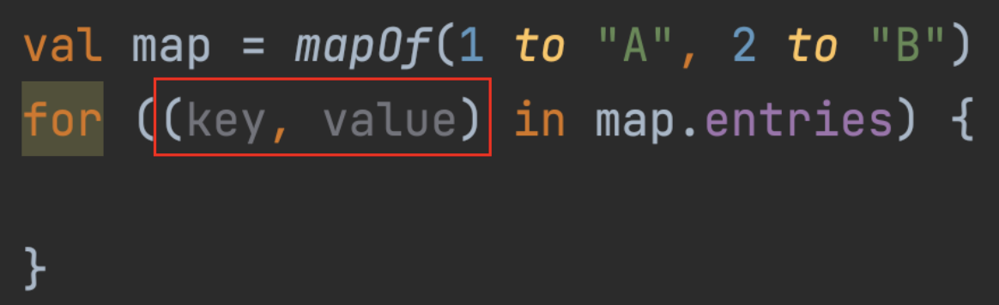


> 참고로 구조 분해 선언은 var과 val에만 선언할 수 있으며 클래스 프로퍼티를 정의할 때는 사용할 수 없다.

---

# ✅ 널이 될 수 있는 타입

- 자바에서는 참조타입에 null을 담을 수 있다. 하지만 null을 정상적인 값과 같은 방식으로 다루면 NPE가 발생한다.
- 이 문제를 해결하려면 null을 허용하지 않으면 되는데, 코틀린은 자바와 100% 호환이 되어야 한다.
- 그래서 코틀린은 nou-nullable 타입과 nullable 타입을 구분해서 사용한다.
- 코틀린에서 기본적으로 모든 타입은 non-nullable 타입이며 nullable 타입으로 사용하고 싶을경우 타입이름 뒤에 `?` 를 붙여서 널이 될 수 있는 타입을 명시한다.

```kotlin
// String과 String? 타입은 서로 다른 타입이다.
val non_nullable: String = null // 컴파일 에러 발생
val nullable: String? = null // null 허용
```

Map은 해당 키가 없으면 null을 반환한다. 따라서 nullable 타입으로 반환타입을 명시하지 않으면 아래와 같은 컴파일 에러가 발생한다.

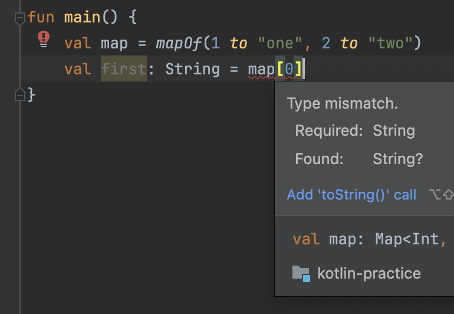

---

# ✅ 안전한 호출과 엘비스 연산자

널이 될 수 있는 타입에는 여러 제약이 있다.

```kotlin
fun main() {
    val str: String? = null
    // 아래는 컴파일 되지 않는다.
    // s.length // null일 수 있기 때문에 컴파일 에러가 발생한다.
}
```

### Safe Call : 안전한 호출

Safe Call은 `null`이 아니면 실행하고, `null` 이면 실행하지 않는다.(그대로 `null`)

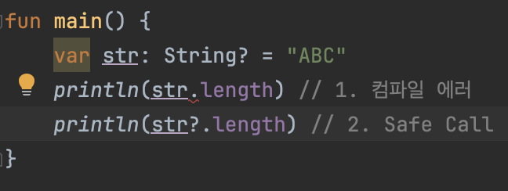

- 1번은 str이 nullable 타입으로  `null` 값이 허용되기 때문에 컴파일 에러가 발생한다.
- 2번은 Safe Call로 str이 `null` 이 아닌 경우에만 실행하기 때문에 컴파일 에러가 발생하지 않는다.
  - str이 `null` 이라면 `null` 자체를 반환한다.  
  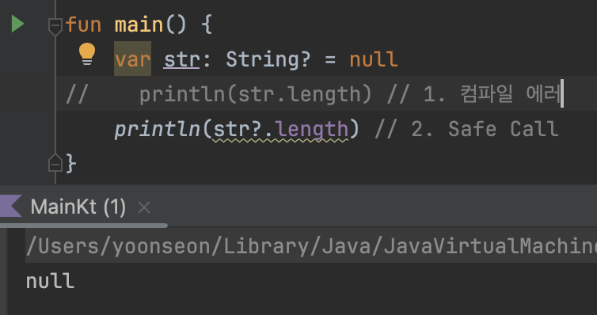

### Elvis

- Safe Call `?.` 의 결과로 null을 만들어 내는 것 이상의 일이 필요하다면 **엘비스(Elvis) 연산자**를 사용할 수 있다.
- Elvis는 앞의 연산 결과가 `null` 이면 뒤의 값을 사용한다.

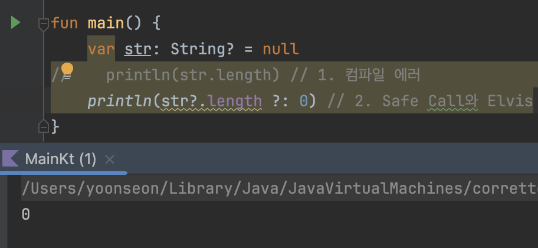

보통은 Elvis를 Safe Call 다음에 사용한다. Safe Call이 null 수신 객체에 대해 만들어내는 null 대신 디폴트 값을 제공하기 위해서다.

```kotlin
fun startWithA(str: String?): Boolean {
    return str?.startWith("A") ?: false
}
```

아래와 같이 예외를 던질때도 유용하게 사용할 수 있다.

```kotlin
fun startWithA(str: String?): Boolean {
    return str?.startWith("A") ?: IllegalArgumentException("null이 들어왔습니다.")
}
```

---

# ✅ 널 아님 단언

개발을 하다보면 객체가 nullable 타입 이지만 초기화 된 이후 절 때 null이 될 수 없는 경우가 있는데 이 경우 널 아님 단언(`!!`)을 사용할 수 있다.

- `x!!` 는 `x` 변수가 null 일 수도 있다는 사실을 무시하고, 개발자가 null이 아님을 보증한다라는 뜻이다.
- `x!!` 는 `x` 가 null이 아니면 `x` 를 내놓고 `x` 가 null이면 오류를 발생시킨다.

    ```kotlin
    var x: String? = "abc"
    x = null
    val s: String = x!! // NPE가 발생한다.
    ```

보통 널 아님 단언은 아래와 같이  nullable 타입 이지만 초기화 된 이후 절때 null이 될 수 없는 경우에 사용한다.

```kotlin
fun main( {
    val s: String? = "abc" // val로 초기화되어서 null일 수 없지만 타입은 nullable 타입이다.
//    println(s.length)    // s는 null일 수 없지만 컴파일러는 null 가능성을 보고 컴파일 에러를 발생시킨다.
    println(s!!.length)    // 이런 경우 널 아님 단언은 사용한다.
)
```

🔥 널 아님 단언을 사용하지 않고 안전한 호출이나 명시적인 null 검사를 활용하는 쪽을 권장한다.

**컴파일 단계에서만 넘어가는거라, 런타임 시점에 `null`이 들어오면 `NPE` 발생할 수 있기 때문이다.**

---

# ✅ 확장 함수와 널이 될 수 있는 타입

`s?.f()` 는 `s` 가 null이 될 수 있는 타입을 명시한다. `s` 가 null이 아니라면 `s.f()` 을 호출할 것이다.

마찬가지로 `t.f()` 는 `t` 가 null이 될 수 없는 타입을 암시하는 것 처럼 보인다.

하지만 `t` 가 꼭 null이 될 수 없는 타입인 것은 아니다!

아래의 두 함수는 함수명 자체에서 수신 객체가 null 일 수 있음을 명백히 드러낸다.

- `isNullOrEmpty()` : 수신 String이 null 이거나 빈 문자열인지 검사한다.
- `isNullOrBlank()` : `isNullOrEmpty()` + 공백 문자로 구성되어있는지 검사한다.

```kotlin
val str1: String? = null
println(str1.isNullOrEmpty()) // true
println(str1.isNullOrBlank()) // true

val str2: String = ""
println(str2.isNullOrEmpty()) // true
println(str2.isNullOrBlank()) // true

val str3: String = " \t\n"
println(str3.isNullOrEmpty()) // true
println(str3.isNullOrBlank()) // false
```

이 두 함수는 String?의 확장 함수로 정의되어 있기 때문에 `str1`은 null이 될 수 있는 타입이지만, Safe Call을 사용하지 않고 `isNullOrEmpty()` 나 `isNullOrBlank()`를 호출할 수 있다.

`isNullOrEmpty` 를 널이 될 수 있는 String? `s` 를 파라미터로 받는 비 확장 함수로 다시 작성할 수 있다.

```kotlin
fun isNullOrEmpty(s: String?): Boolean =
    s == null || s.isEmpty()

fun main() {
    isNullOrEmpty(null) // true
    isNullOrEmpty("") // true
}
```

- `||`에서 첫번째 식이 true면 다음 식 검사 없이 true를 반환하므로 s가 null 이어도 NPE가 발생하지 않는다.

확장함수는 `this` 를 사용해 수신 객체를 표현한다. 이때 수신 객체를 null이 될 수 없는 타입으로 지정하려면 확장 대상 타입 뒤에 `?`를 붙이면 된다.

```kotlin
fun String?.isNullOrEmpty(): Boolean = 
    this == null || isEmpty()

fun main() {
    println("".isNullOrEmpty()) // trye
}
```

위에서 작성한 비 확장함수로 만든 것 보다 확장 함수 `isNullOrEmpty()`이 더 읽기에 좋아보인다.

🔥 nullable 타입을 확장할 때는 주의해야 한다.   
`isNullOrEmpty()`나 `isNullOrBlank()`처럼 상황이 단순하고 함수 이름에서 수신 객체가 null일 수 있음을 암시하는 경우에는 nullable 타입의 확장 함수가 유리하다.  
그러나 일반적으로는 non-nullable 타입의 확장을 정의하는 것이 좋다. Safe Call과 명시적인 검사는 수신 객체의 null 가능성을 더 명확히 드러내지만, nullable 타입의 확장 함수는 null 가능성을 감추어 코드를 읽는 독자를 혼란스럽게 할 수 있다.

---

# ✅ 제네릭

```kotlin
class GenericHolder<T>(
  private val value: T
) {
    fun getValue() = this.value
}
```

- `T` : 타입 파라미터

### 유니버설 타입

유니버설 타입은 모든 타입의 부모 타입니다.  
코틀린에서의 유니버설 타입은 `Any` 이다. `Any` 타입은 모든 타입의 인자를 허용한다.(자바에서는 `Object` )

### 제네릭 함수

제네릭 함수는 부등호로 둘러싼 제네릭 타입 파라미터를 함수 이름 앞에 붙인다.

```kotlin
fun <T> identity(arg: T): T = arg
```

코틀린 표준 라이브러리는 컬렉션을 위한 여러 제네릭 함수를 제공한다.  
제네릭 확장 함수를 쓰려면 수신 객체 앞에 제네릭 명세(괄호로 둘러싼 타입파라미터 목록)를 위치시켜야 한다.  

`first()` 나 `firstOrNull()` 의 정의를 예로 볼 수 있다.

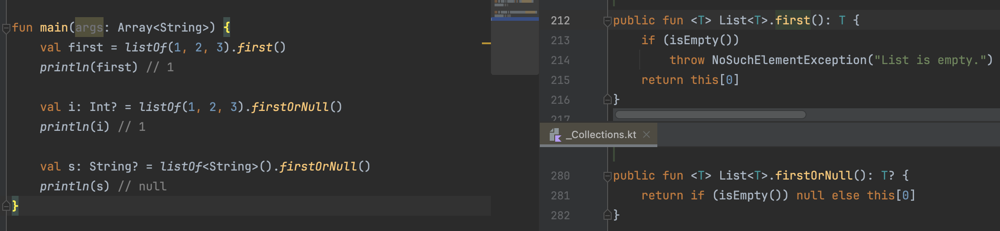

`first()` 나 `firstOrNull()` 은 모든 List에 대해 작동할 수 있고 `T` 타입의 값을 반환하기 위해서 제네릭 함수로 정의되어있다.

---

# ✅ 확장 프로퍼티

- 확장 프로퍼티는 클래스의 인스턴스에 새 프로퍼티를 추가할 수 있게 해주는 기능이다.
- 확장 함수와 비슷하지만 프로퍼티 형태로 확장한다.
- 확장 프로퍼티는 실제로 클래스에 새로운 필드를 추가하지 않고, 기존 클래스의 인스턴스에 새로운 프로퍼티를 추가한 것 처럼 보이게 한다.
- 확장 프로퍼티를 정의하려면 기존 클래스의 인스턴스를 수신 객체(`this`)로 사용하고, 프로퍼티의 Getter를 커스텀 한다.(확장 함수와 동일하게 `private` 멤버에 접근할 수 없다.)

```kotlin
val String.lastChar: Char
    get() = this[this.length - 1]

fun main() {
    val str = "Kotlin"
    println(str.lastChar) // 출력: n
}
```

제네릭 확장 프로퍼티도 가능하다.

```kotlin
val <T> List<T>.middleItem: T?
    get() = if (this.isNotEmpty()) this[this.size / 2] else null
```

제네릭 타입의 구체적인 타입 인수를 모르거나 중요하지 않을 때 **스타 프로젝션**(`*`)을 사용할 수 있다.

```kotlin
val List<*>.firstOrNull: Any? // 제네릭으로 선언했으나 타입을 모를 때
    get() = if (this.isNotEmpty()) this[0] else null
```

`List<*>`는 **스타 프로젝션**을 사용하여 제네릭 타입 파라미터를 알 수 없거나 중요하지 않음을 나타낸다.

이는 모든 종류의 리스트와 호환되기 때문에 `List<*>`는 타입 안전성을 유지하면서 모든 리스트 타입을 다룰 수 있다.

### `List<*>`를 사용하는 경우

```kotlin
val List<*>.firstOrNull: Any? 
    get() = if (this.isNotEmpty()) this[0] else null

fun main() {
    val intList: List<Int> = listOf(1, 2, 3)
    val stringList: List<String> = listOf("a", "b", "c")
    val mixedList: List<Any?> = listOf(1, "a", null)

    println(intList.firstOrNull) // 출력: 1
    println(stringList.firstOrNull) // 출력: a
    println(mixedList.firstOrNull) // 출력: 1
}
```

- `List<*>` 를 사용하면 List에 담긴 원소의 타입 정보를 모두 잃어버린다. 예를들어 List<*>에서 얻은 원소는 `Any?` 에만 대입할 수 있다.
- `List<*>` 에 저장된 값이 널이 될 수 있는 타입인지에 대해서 아무 정보가 없기 때문에 해당 값을 `Any?` 타입의 변수에만 담을 수 있다.

---

# ✅ break와 continue

코틀린에서는 `for`, `while`, `do-while` 루프에서 `break`와 `continue`를 사용해 **제한적인 점프**를 제공한다.

- `break` : 가장 가까운 루프가 제거된다. (= 루프의 끝으로 점프한다.)
- `continue` : 가장 가까운 루프를 다음 step으로 보낸다.(= 루프의 시작위치로 점프한다.)

### 라벨

단순한 `break`와 `continue` 는 자신이 속한 루프의 범위보다 더 밖으로 점프할 수 없다.  
하지만 **라벨**을 사용하면 자신을 둘러싼 여러 루프의 경계 중 한 곳으로 점프할 수 있다.

특정 expression에 `라벨명@` 을 붙여 하나의 레이블로 간주하고 `break`, `continue`, `return` 등을 사용할 수 있다.

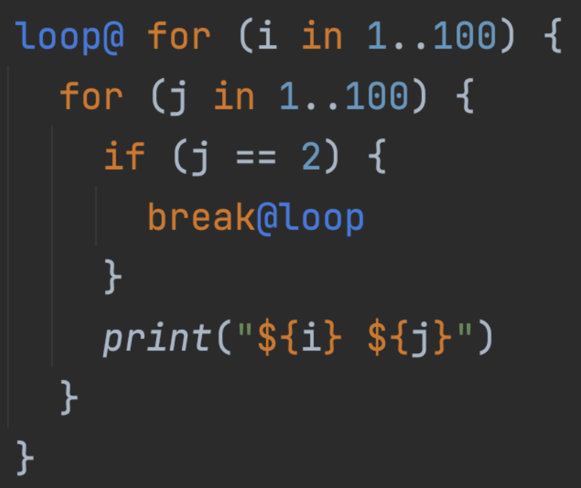

- 중첩 for문 이지만 `break@loop` 가 가장위에 있는 `loop@` 를 가르키기 때문에 첫 번째 for문을 멈춰버린다.

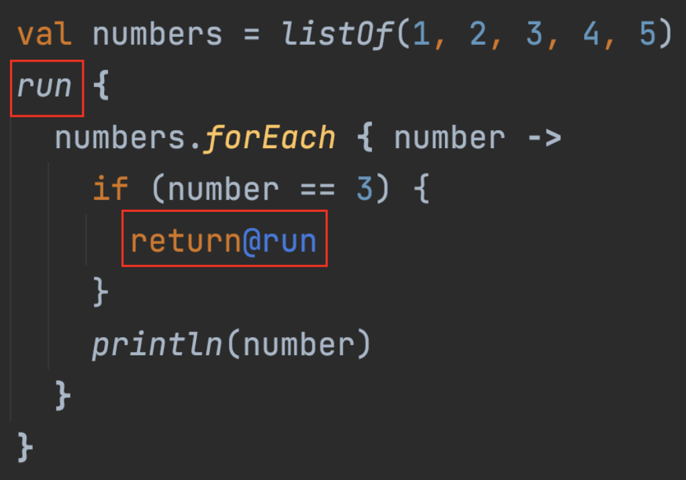

- @run 이 run을 가르켜서 return 하여 멈춘다.

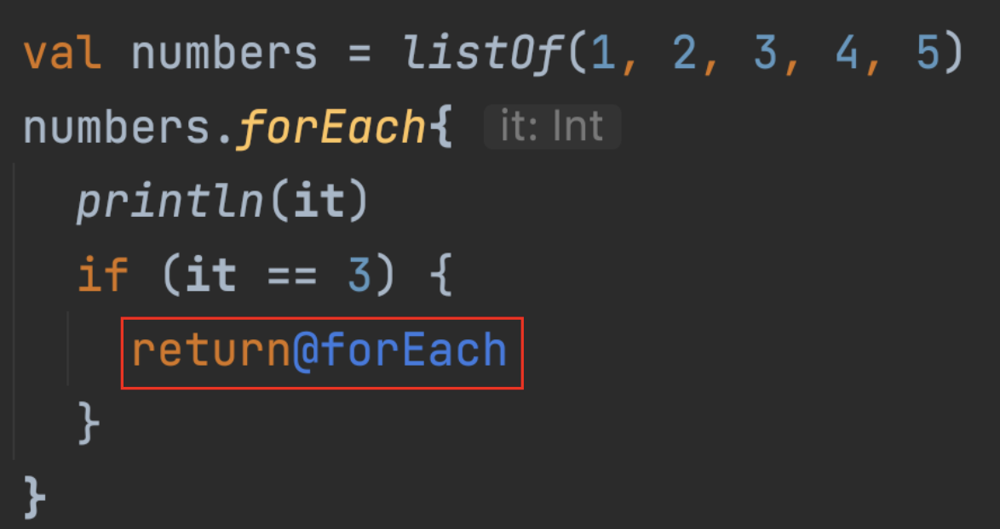

- 특정 조건에서 `forEach` 자체를 `return` 시켜서 `forEach`가 끝나는 것이 아니라 그 한번만 건너뛰게 된다.

> 하지만 라벨을 사용한 Jump는 사용하지 않는 것을 추천한다.
코드의 흐름이 위 아래로 움직일수록 복잡도가 드라마틱하게 증가하고 유지보수가 힘들어진다.
