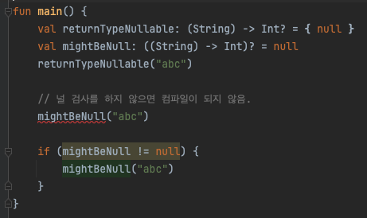
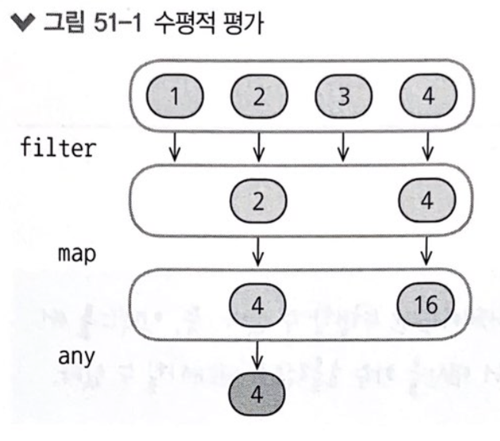
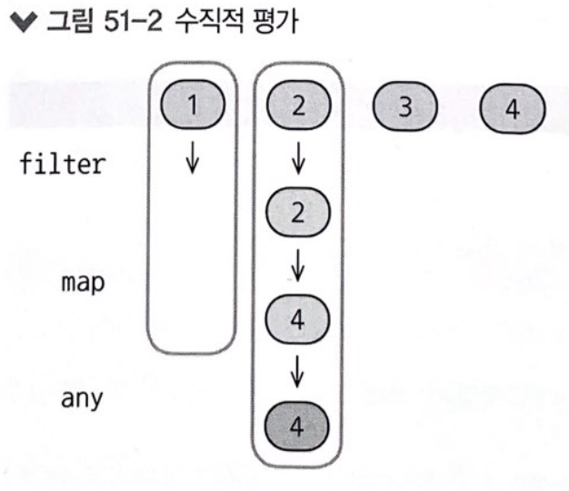
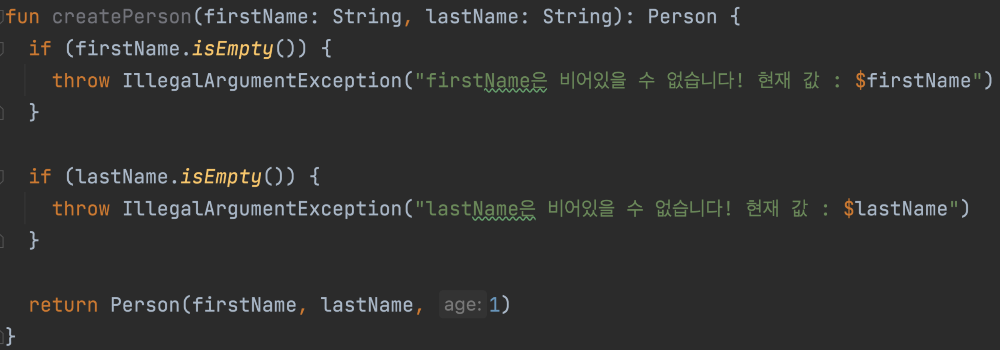
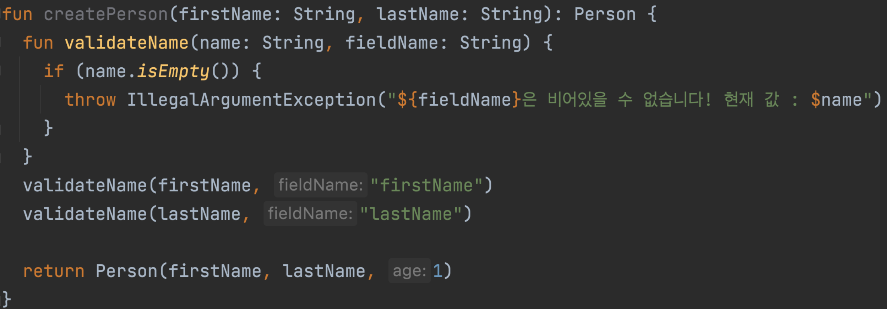

# ✅ 람다

## map()

- `map()`은 List 같은 컬렉션에 작용하는 함수로, `map()`의 파라미터는 컬렉션의 모든 원소에 적용할 변환 함수다.
- `map()`은 원본 List의 모든 원소에 변환 함수를 적용해 얻은 새로운 원소로 이뤄진 새 List를 반환한다.

```kotlin
fun main() {
    val list = listOf(1, 2, 3, 4)
    val result = list.map ({ n -> "[$n]" }) // 람다

    result.forEach { element -> print(element) }
}
// 출력
// [1][2][3][4]
```

- result를 초기화할 때 중괄호 사이에 쓴 코드가 람다다. 파라미터 목록과 함수 본문 사이에는 → 가 들어간다.
- 함수 본문은 하나 이상의 식이다. 식이 여렷인 경우 마지막 식이 람다의 결과가 된다.

파라미터가 하나일 경우 코틀린은 자동으로 이름을 `it` 으로 만든다. 따라서 아래와 같이 더 간결하게 사용할 수 있다.

```kotlin
val result = list.map({ "[$it]" }) // it 적용
```

함수의 파라미터가 람다뿐이면 람다 주변의 소괄호`()`를 생략할 수 있다.

```kotlin
val result = list.map { "[$it]" } // 소괄호 제거
```

함수가 여러 파라미터를 받고 람다가 마지막 파라미터인 경우에는 람다를 인자 목록을 감싼 괄호 다음에 위치시킬 수 있다.

```kotlin
val numbers = listOf(9, 11, 23, 32)

// joinToString 마지막 인자로 람다를 지정
val joinToString = numbers.joinToString(" ") { "[$it]" }

joinToString.forEach { str -> print(str) }

// 출력
// [9] [11] [23] [32]
```

람다가 특정 인자를 사용하지 않는경우 `_`를 사용할 수 있다.

`_`를 사용하면 특정 인자를 사용하지 않는다는 컴파일러 경고를 무시할 수 있다.

- `_` 사용 전

    ```kotlin
    val list = listOf("a", "b", "c")
    val mapIndexed = list.mapIndexed { index, element ->
        "[$index: $element]"
    }
    mapIndexed.forEach { print(it) }
    
    // 출력 
    // [0: a][1: b][2: c]
    ```

- `_` 사용 후

    ```kotlin
    val list = listOf("a", "b", "c")
    val mapIndexed = list.mapIndexed { index, _ ->
        "[$index]"
    }
    mapIndexed.forEach { print(it) }
    
    // 출력 
    // [0][1][2]
    ```

  위 함수는 indices와 it을 사용해서 아래와 같이 리팩토링 가능하다.

    - `indices` : 0부터 리스트의 size-1 까지의 값을 가지는 `IntRange` 객체

    ```kotlin
    val mapIndexed = list.indices.map { 
        "[$it]"
    }
    ```


### 람다에 파라미터가 없을 수도 있다.

이 경우 파라미터가 없다는 사실을 강조하기 위해 화살표를 남겨둘 수 있지만, 코틀린 스타일 가이드에서 화살표를 사용하지 말라고 권장한다.

```kotlin
run { -> println("dasd") } // 파라미터가 없어도 -> 작성 가능하지만 권장되지 않음
run { println("dasd") }
```

---
# ✅ 람다의 중요성

람다를 사용하지 않으면 컬렉션을 조작하거나 변환하는 연산을 직접 구현해야한다.

람다를 사용해서 컬렉션을 간편하게 조작할 수 있다.

- 람다 사용전

    ```kotlin
    fun main() {
        var nums = listOf(1, 2, 3, 4)
        val result = nums
            .filterEven()
            .greaterThan2()
        result.forEach { print("${it} ")} // 4
    }
    
    fun List<Int>.filterEven(): List<Int> {
        val result = mutableListOf<Int>()
        for (i in this) {
            if (i % 2 == 0) {
                result.add(i)
            }
        }
        return result
    }
    
    fun List<Int>.greaterThan2(): List<Int>{
        val result = mutableListOf<Int>()
        for (i in this) {
            if (i > 2) {
                result.add(i)
            }
        }
        return result
    }
    ```

- 람다 사용 후

    ```kotlin
    val result = nums.filter { it % 2 == 0 && it > 2 }
    result.forEach { print("${it} ")} // 4
    ```


위와 같이 람다를 사용하면 반복을 피하고, 간결하면서 명확한 코드를 작성할 수 있다.

> filter()는 컬렉션에서 원소를 선택하는 코드를 작성하면 개발자가 직접 처리해야 했을 이터레이션을 처리해준다. 이터레이션을 직접 관리하는 게 그다지 큰 수고는 아니지만, 실수할 여지가 있는 세부 사항이기에 filter를 사용해 버그 가능성을 낮출 수 있다.
>

함수형 프로그래밍을 적용 했기에 더 튼튼한 코드를 더 빨리 작성할 수 있다.

### 람다식을 변수에 할당 가능

람다식을 `val`, `var` 에 담을 수 있다. 따라서 여러 함수에 같은 람다식을 재사용할 수 있다.

```kotlin
fun main() {
    val list = listOf(1, 2, 3, 4)
    val isEven = { e: Int -> e % 2 == 0}
    list.filter(isEven)
    list.any(isEven)
}
```

- `any()` : 주어진 술어를 만족하는 원소가 List에 하나라도 존재하는지 검사한다.

## 클로저(자바와 비교)

### 코틀린

클로저는 함수가 자신이 정의된 스코프(scope) 내의 변수들을 포획하여 사용하는 것을 의미한다.

람다는 같은 스코프 내에 있는 변수들을 캡처하고 수정할 수 있다.

```kotlin
fun main() {
    var sum = 0
    val numbers = listOf(1, 2, 3, 4)

    numbers.forEach { number ->
        sum += number // 람다에서 밖에있는 변수를 참조해서 수정함
    }

    println("Sum: $sum") // 출력: Sum: 10
}
```

위 예제에서 람다 `{ number -> sum += number }`는 `sum` 변수를 캡처하고, 람다 내부에서 이를 수정할 수 있다. 이와 같이, 람다 함수는 같은 스코프 내에 있는 변수를 자유롭게 사용할 수 있다.

### 자바

코틀린과 달리 자바의 람다는 캡처된 변수가 `final` 또는 효과적으로 `final`이어야 한다는 제약이 있다.
즉, 람다 표현식 내에서 캡처된 변수를 변경할 수 없음

```java
public static void main(String[] args) {
    int sum = 0;  // 이 변수는 effectively final이어야 함
    List<Integer> numbers = Arrays.asList(1, 2, 3, 4);

    // sum 변수는 effectively final이어야 하기 때문에 컴파일 오류가 발생
    numbers.forEach(number -> sum += number);

    System.out.println("Sum: " + sum);
}
```

위 코드는 컴파일되지 않는다. `sum` 변수가 변경되기 때문에 `effectively final`이 아니기 때문이다.

- `effectively final` : 자바에서 `final` 키워드가 선언되지 않은 변수지만, 값이 재할당되지 않아 `final` 과 유사하게 동작하는 것

### 비교

- **코틀린** : 클로저가 스코프 내의 변수를 자유롭게 수정할 수 있다.
- **자바** : 클로저는 `final` 또는 `effectively final` 인 변수만 캡처할 수 있으며, 람다 내에서 이러한 변수를 직접적으로 수정할 수는 없다.(변수의 값을 변경하기 위해 배열이나 객체 같은 간접적인 방법을 사용해야 함)

---

# ✅ 컬렉션에 대한 연산

- filter() : 주어진 술어와 일치하는(술어가 true를 반환하는) 모든 원소가 들어 있는 새 리스트를 만든다.
- any() : 원소 중 어느 하나에 대해 술어가 true를 반환하면 ture를 반환한다.
- all() : 모든 원소가 술어와 일치하는지 검사한다.
- none() : 술어와 일치하는 원소가 하나도 없는지 검사한다.
- find() : 술어와 일치하는 첫 번째 원소를 반환한다. 원소가 없을 경우 예외가 발생한다.
- findOrNull() : 술어와 일치하는 첫 번째 원소를 반환한다. 원소가 없을 경우 null을 반환한다.
- count() : 술어와 일치하는 원소의 개수를 반환한다.

---

# ✅ 멤버 참조

함수 인자로 멤버 참조를 전달할 수 있다.

함수, 프로퍼티, 생성자에 대해 만들 수 있는 멤버 참조는 해당 함수, 프로퍼티, 생성자를 호출하는 뻔한 람다를 대신할 수 있다.

### 함수 참조

```kotlin
fun main() {
    val numbers = listOf(1, 2, 3, 4, 5)

    // 메서드 참조를 사용하여 각 요소를 문자열로 변환
    val stringList = numbers.map(Int::toString)

    println(stringList)  // 출력: [1, 2, 3, 4, 5]
}
```

### 프로퍼티 참조

```kotlin
data class Person(val name: String, val age: Int)

fun main() {
    val people = listOf(Person("Alice", 30), Person("Bob", 25))

    // 프로퍼티 참조를 사용하여 각 사람의 이름을 추출
    val names = people.map(Person::name)

    println(names)  // 출력: [Alice, Bob]
}

```

### 생성자 참조

```kotlin
data class Person(val name: String, val age: Int)

fun main() {
    // Person 클래스의 생성자 참조
    val personFactory = ::Person

    // 생성자를 사용하여 새로운 Person 객체 생성
    val person1 = personFactory("Alice", 30)
    val person2 = personFactory("Bob", 25)

    println(person1)  // 출력: Person(name=Alice, age=30)
    println(person2)  // 출력: Person(name=Bob, age=25)
}
```

### 확장함수 참조

```kotlin
// String 클래스에 대한 확장 함수 정의
fun String.reverse(): String {
    return this.reversed()
}

fun main() {
    // 확장 함수 참조
    val reverseFunction = String::reverse

    val original = "Kotlin"
    val reversed = reverseFunction(original)  // 확장 함수 참조를 사용하여 호출

    println(reversed)  // 출력: niltoK
}

```

---

# ✅ 고차 함수

- 고차함수 : **다른 함수를 매개변수로 받거나**, **함수를 결과로 반환하는** 함수

함수의 반환타입이 null이 될 수 있는 타입 있는 경우가 있다.

```kotlin
fun main() {
    val transform: (String) -> Int? = {
        s: String -> s.toIntOrNull() // s.toIntOrNull()은 null 반환 가능
    }
    var x = listOf("112", "abc")
    val mapNotNull = x.mapNotNull(transform) // 함수를 파라미터로 전달
    println(mapNotNull) // [112]
}
```

- toIntOrNull()은 null을 반환할 수 있기에 tansform은 String을 받아서 Int? 타입 값을 반환한다.
- mapNotNull()은 List의 각 원소를 null이 될 수 있는 값으로 변환하고 변환 결과에서 null은 제외시킨다.
- 이는 map을 호출해 얻은 결과에 filterNotNull()을 호출한 것과 같다.
- 반환 타입을 null이 될 수 있는 타입으로 만드는 것과 함수 전체 타입을 널이 될 수 있는 타입으로 만드는 것의 차이점에 주의해라.    

  

- mightBeNull에 저장된 함수를 호출하기 전에 함수 참조 자체가 null이 아닌지 반드시 검사해야한다.

---

# ✅ 리스트 조작하기

## 묶기

`zip()` 재킷의 지퍼처럼 두 List의 원소를 하나씩 짝짓는 방식으로 묶는다.

```kotlin
fun main() {
    val left = listOf("a", "b", "c", "d")
    val right = listOf("A", "B", "C", "D")

    left.zip(right).forEach { print("[${it}] ") } // #1
    
    left.zip(0..4).forEach { print("[${it}] ") } // #2
    
    (10..100).zip(right).forEach { print("[${it}] ") } // #3
}

// 출력
// #1 : [(a, A)] [(b, B)] [(c, C)] [(d, D)] 
// #2 : [(a, 0)] [(b, 1)] [(c, 2)] [(d, 3)] 
// #3 : [(10, A)] [(11, B)] [(12, C)] [(13, D)] 
```

- #1 : left와 rigit를 묶으면 Pair로 이루어진 List가 생긴다. 이때 left와 right에서 같은 위치에 있는 원소를 결합해준다.
- #2 : List와 범위를 zip()할 수도 있다.
- #3 : 범위 (10..100)은 right보다 원소가 훨씬 많지만, 두 시퀀수 중 어느 한쪽이 끝나면 묶기 연산도 끝난다.

zip() 함수는 만들어진 Pair에 대해 연산을 적용하는 기능도 있다.

```kotlin
fun main() {
    val numbers1 = listOf(1, 2, 3)
    val numbers2 = listOf(4, 5, 6)

    // 두 리스트를 zip()으로 병합
    val zipped = numbers1.zip(numbers2)

    // 각 Pair의 요소를 곱한 값을 포함하는 리스트 생성
    val products = zipped.map { (num1, num2) -> num1 * num2 }

    println(products) // 출력: [4, 10, 18]
}
```

`zipWithNext()` 함수는 컬렉션 요소들의 현재와 다음 요소를 쌍으로 묶어서 Pair 객체로 구성된 리스트를 반환한다.

```kotlin
fun main() {
    val numbers = listOf(1, 2, 3, 4, 5)

    // zipWithNext()를 사용하여 현재 요소와 다음 요소를 쌍으로 묶기
    val zippedWithNext = numbers.zipWithNext()
    println(zippedWithNext)  // 출력: [(1, 2), (2, 3), (3, 4), (4, 5)]

    val stringList = numbers.zipWithNext { a, b -> "$a$b" }
    println(stringList) // 출력 [12, 23, 34, 45]
}
```

## 평평하게 하기

`flatten()`은 각 원소가 List인 List를 받아서 원소가 따로따로 들어있는 List를 반환함

```kotlin
fun main() {
    val list = listOf(
        listOf(1,3,5),
        listOf(2,4,6),
        listOf(7,8,9),
    )

    val result = list.flatMap { it }
    println(result) // 출력 : [1, 3, 5, 2, 4, 6, 7, 8, 9]
}
```

`flatMap()` 은 컬렉션에서 중요한 연산인데, 이를 이해하는데는 flatten이 중요하다.

```kotlin
fun main() {
    val intRange = 1..3

    // # 1
    intRange.map { a ->
        intRange.map { b -> a to b }
    }
    
    // #2
    intRange.map { a ->
        intRange.map { b -> a to b }
    }.flatten()
    
    // #3
    intRange.flatMap { a ->
        intRange.map { b -> a to b }
    }
}

// 3가지 방법 모두 동일한 값을 갖는다.
// [[(1, 1), (1, 2), (1, 3)], [(2, 1), (2, 2), (2, 3)], [(3, 1), (3, 2), (3, 3)]]
```

- #1 : `map()`은 intRange에 속한 각 원소에 대응하는 List가 생겼다는 정보를 유지해준다.
- #2 : `flattten()` 을 적용해 결과를 평평하게 해서 부가적인 구조(내포된 List구조)를 없애고 단일 List로 만든다.
  - 이 방법도 좋지만, `map()`과 `flatten()`을 모두 수행해주는 `flatMap()`이라는 합성 연산을 제공한다.
- #3: `flatMap()`을 사용하여 각 `a`에 대해 `intRange`의 모든 `b`와 쌍을 생성하고, 이 결과를 자동으로 단일 List로 평탄화한다. `flatMap()`은 `map()`과 `flatten()`을 결합하여 한 번의 연산으로 결과를 생성함

### flatMap()의 두 번째 예시

```kotlin
class Book(
    val title: String,
    val author: List<String>,
)

fun main() {
    val books = listOf(
        Book("Kotlin", listOf("홍주광", "이윤선")),
        Book("Java", listOf("박석희")),
    )
	
    val map = books.map { it.author }
    println(map) // 출력 : [[홍주광, 이윤선], [박석희]]
    
    val mapAndFatten = books.map { it.author }.flatten()
    println(mapAndFatten) // 출력 : [홍주광, 이윤선, 박석희]
    
    val flatMap = books.flatMap { it.author }
    println(flatMap) // 출력 : [홍주광, 이윤선, 박석희]
}
```

- `map()` 은 작가의 ‘List의 List’를 생성하지만 사용하기 편한 구조가 아니기에 `flatten()` 으로 평탄화 작업을 수행한다.
- `flatMap()`을 사용하면 위와 같은 작업을 단번에 수행해 준다.

### flatMap() 세 번째 예시

```kotlin
fun main() {
    val rand = Random(26)

    val deck = Suit.values().flatMap { suit ->
        Rank.values().map { rank ->
            Card(rank, suit)
        }
    }
    repeat(7) {
        println( deck.random(rand) )
    }

}

enum class Suit {
    Spade, Club, Heart, Diamond
}

enum class Rank(
    private val faceValue: Int
) {
    Ace(1), Two(2), Three(3),
    Four(4), Five(5), Six(6);
}

class Card(
    private val rank: Rank,
    private val suit: Suit,
) {
    override fun toString(): String {
        return "Card(rank=$rank, suit=$suit)"
    }
}
```

1. `Suit.values()`는 Suit 모든 요소를 배열로 반환함 → [Spade, Club, Heart, Diamond]
2. flatMap의 람다 함수는 suit를 매개변수로 받고, `Rank.values()`를 통해 Rank 열거형의 모든 값을 순회하면서 각 `rank`에 대해 `Card(rank, suit)` 객체를 생성함
3. `Rank.values().map { rank -> Card(rank, suit) }`는 suit마다 Rank에 대해 카드 객체를 생성하여 리스트를 만듬
   즉, 각 suit에 대해 6개(Rank 개수 만큼)의 Card 객체가 포함된 리스트를 생성하게됨.

`flatMap`은 이러한 중첩된 리스트를 평탄화하여 단일 List로 결합한다.

---

# ✅ 맵 만들기

## group by()

- `groupBy()` : 주어진 조건에 따라 컬렉션의 원소들을 그룹화한다. 각 원소에 대해 람다를 적용하여 키를 만들고, 동일한 키를 가진 원소들을 하나의 리스트로 묶어서 맵을 만든다.

```kotlin
val names = listOf("Alice", "Bob", "Charlie", "David")

val ages = listOf(15, 27, 15, 29)

fun people(): List<Person> =
    names.zip(ages) { name, age ->
        Person(name, age)
    }
    
fun main() {
    val map = people().groupBy(Person::age)

    println(map)
}
// 출력
// {15=[Person(name=Alice, age=15), Person(name=Charlie, age=15)], 27=[Person(name=Bob, age=27)], 29=[Person(name=David, age=29)]}
```

- 위 예제에서는 `groupBy()` 의 파라미터를 Person의 age로 받아 키로 사용한다.
- 원본 컬렉션의 각 원소에 이 람다를 적용해 키 값을 얻은 후 맵에 넣어준다.
- 이때 키가 같은 같이 둘 이상 있을 수 있으므로 맵의 값은 원본 컬렉션의 원소 중에 키에 해당하는 값의 리스트가 되어야 한다.

### groupBy() vs filter() vs partition()

- `groupBy()` : 주어진 조건에 따라 컬렉션의 원소들을 그룹화한다. 각 원소에 대해 람다를 적용하여 키를 만들고, 동일한 키를 가진 원소들을 하나의 리스트로 묶어서 맵을 만든다.
- `filter()` : 주어진 조건에 맞는 원소들만 필터링하여 새로운 리스트를 만든다. 특정 조건에 맞는 원소들만 추출함.
- `partition()` : 주어진 조건을 만족하는 원소들과 그렇지 않는 원소를 각각 두개의 리스트로 나눈다. 첫 번째 리스트는 조건을 만족하는 리스트, 두 번째 리스트에는 조건을 만족하지 않는 리스트가 포함됨.

`groupBy()`는 단 한 번의 연산으로 여러 그룹을 만들 수 있지만, `filter()` 는 동일한 결과를 얻으려면 여러 번의 반복이 필요하다. 따라서 그룹 분류를 단 한 번에 할 수 있는 `groupby()`가 더 낫다.

```kotlin
fun main() {
    // groupBy()는 빠르게 Map을 만든다.
    val groups = people().groupBy { it.name.first() }
    println(groups) // {A=[Person(name=Alice, age=15)], B=[Person(name=Bob, age=27)], C=[Person(name=Charlie, age=15)], D=[Person(name=David, age=29)]}

    // filter()를 사용하면 각 문자에 대해 filter()를 반복 실행해야 한다.
    val groupA = peopleList.filter { it.name.first() == 'A' }
    val groupB = peopleList.filter { it.name.first() == 'B' }
    val groupC = peopleList.filter { it.name.first() == 'C' }
    val groupD = peopleList.filter { it.name.first() == 'D' }
    // 필터링된 결과를 수동으로 맵에 넣어야함
    val groups = mapOf( 
        'A' to groupA,
        'B' to groupB,
        'C' to groupC,
        'D' to groupD
    )
    println(map) // {A=[Person(name=Alice, age=15)], B=[Person(name=Bob, age=27)], C=[Person(name=Charlie, age=15)], D=[Person(name=David, age=29)]}
    
    // partition() 함수는 조건을 만족하는 원소들과 그렇지 않은 원소들을 두 개의 리스트로 나눈다.
    val partition = people().partition {
        it.name.first() == 'A'
    }
    println(partition) // ([Person(name=Alice, age=15)], [Person(name=Bob, age=27), Person(name=Charlie, age=15), Person(name=David, age=29)])
}
```

- 그룹이 두 개만 필요하고 술어에 의해 컬렉션 내용을 두 그룹으로 나눌 때는 `partition()`이 유용하다.

### associateWith() vs associateBy()

리스트에 `associateWith()` 를 사용하면, 리스트의 각 원소를 키로 하고 `associateWith()` 에 전달된 함수를 적용한 값을 value로 하는 Map을 만들 수 있다.

```kotlin
data class Person(val name: String, val age: Int)

val names = listOf("Alice", "Bob", "Charlie", "David")
val ages = listOf(15, 27, 15, 29)

fun people(): List<Person> =
    names.zip(ages) { name, age ->
        Person(name, age)
    }

fun main() {
    // 리스트의 각 원소를 키로 하고, 이름의 첫 글자를 값으로 하는 맵을 생성
    val mapByFirstLetter = people().associateWith { it.name.first() }
    
    println(mapByFirstLetter)
    // 출력: {Person(name=Alice, age=15)=A, Person(name=Bob, age=27)=B, Person(name=Charlie, age=15)=C, Person(name=David, age=29)=D}
}
```

`associateBy()` 는 `associateWith()` 가 만들어내는 연관관계를 반대 방향으로 뒤집는다.

즉, 리스트 원소를 맵의 키로 사용하고, 주어진 함수의 결과를 값으로 사용하여 맵을 만든다.(리스트 원소를 키로 사용하고, 주어진 함수의 결과를 값으로 사용하는 `associateWith()` 와 반대)

```kotlin
data class Person(val name: String, val age: Int)

val names = listOf("Alice", "Bob", "Charlie", "David")
val ages = listOf(15, 27, 15, 29)

fun people(): List<Person> =
    names.zip(ages) { name, age ->
        Person(name, age)
    }

fun main() {
    // associateBy()를 사용하여 이름을 키로 하고 Person 객체를 값으로 하는 맵을 생성
    val mapByName = people().associateBy { it.name }
    
    println(mapByName)
    // 출력: {Alice=Person(name=Alice, age=15), Bob=Person(name=Bob, age=27), Charlie=Person(name=Charlie, age=15), David=Person(name=David, age=29)}

    // associateWith()를 사용하여 Person 객체를 키로 하고 나이를 값으로 하는 맵을 생성
    val mapByPerson = people().associateWith { it.age }
    
    println(mapByPerson)
    // 출력: {Person(name=Alice, age=15)=15, Person(name=Bob, age=27)=27, Person(name=Charlie, age=15)=15, Person(name=David, age=29)=29}
}
```

### associateBy() 주의사항

- associateBy()의 주어진 함수의 결과로 생성되는 키는 유일해야 한다. 즉, 같은 키를 가진 두 개 이상의 원소가 있을 수 없다는 것을 보장해야함.
- 만약 같은 키가 두 개 이상 발생하면, `associateBy()`는 마지막으로 발견된 원소만을 포함한 맵을 생성한다.

```kotlin
data class Person(val name: String, val age: Int)

val names = listOf("Alice", "Bob", "Charlie", "David", "Alice")
val ages = listOf(15, 27, 15, 29, 35)

fun people(): List<Person> =
    names.zip(ages) { name, age ->
        Person(name, age)
    }

fun main() {
    // 이름을 키로 하고 Person 객체를 값으로 하는 맵을 생성
    val mapByName = people().associateBy { it.name }
    
    println(mapByName)
    // 출력: {Alice=Person(name=Alice, age=35), Bob=Person(name=Bob, age=27), Charlie=Person(name=Charlie, age=15), David=Person(name=David, age=29)}
    // 'Alice'라는 키를 가진 Person 객체는 두 개 있지만, 맵에는 마지막 'Alice'가 포함됨.

    // 나이를 키로 하고 Person 객체를 값으로 하는 맵을 생성
    val mapByAge = people().associateBy { it.age }

    println(mapByAge)
    // 출력: {15=Person(name=Charlie, age=15), 27=Person(name=Bob, age=27), 29=Person(name=David, age=29), 35=Person(name=Alice, age=35)}
    // 나이가 15인 사람은 여러 명이지만, 맵에는 마지막으로 발견된 'Charlie'가 포함됨.
}
```

### getOrElse(), getOrPut()

- `getOrElse()` : Map에서 키로 값을 찾고 매핑되는 키가 없는 경우 디폴트 값을 계산하는 방법이 담긴 람다를 인자로 받는다.
- `getOrPut()` : Map에서 주어진 키에 대한 값을 검색하고, 키가 존재하지 않으면 주어진 람다를 사용하여 값을 계산하고 맵에 삽입한다. 반환값은 키에 매핑된 값입니다.

```kotlin
fun main() {
    val map = mapOf(1 to "one", 2 to "two", 3 to "three")
    println(map.getOrElse(0) {"값이 없음"}) // 값이 없음

    val mutableMap = map.toMutableMap()
    mutableMap.getOrPut(0) { "zero" }
    println(mutableMap) // {1=one, 2=two, 3=three, 0=zero}
}
```

### filterKeys(), filterValus()

여러 Map 연산이 List가 제공하는 연산과 곂친다. 예를들어 Map의 원소에 대해 `filter()`나 `map()`을 적용할 수 있다. 또한, 키와 값을 별도로 걸러낼 수도 있다.

```kotlin
fun main() {
    val map = mapOf(1 to "one", 2 to "two", 3 to "three")

    val filterKeys = map.filterKeys { it % 2 == 0 }
    println(filterKeys) // {2=two}

    val filterValues = map.filterValues { it == "one" }
    println(filterValues) // {1=one}

    val filter = map.filter { entry -> entry.key != 1 && entry.value.contains('e') }
    println(filter) // {3=three}
}
```

## 맵에 연산 적용하기

Map에 map()을 적용한다는 것은 **맵을 변환한다**는 의미이다.

```kotlin
fun main() {
    val even = mapOf(2 to "two", 4 to "four")
    
    // # 1
    val mapList1 = even.map {
        "${it.key} == ${it.value}"
    }
    println(mapList1) // [2 == two, 4 == four]

    // # 2
    val mapList2 = even.map { (key, value) ->
        "${key} = ${value}"
    }
    println(mapList2) // [2 = two, 4 = four]

    // # 3
    val mapList3 = even.map { (key, value) ->
        -key to "minus ${value}"
    }.toMap()
    println(mapList3) // {-2=minus two, -4=minus four}
}
```

- **# 1 :** `map()` 은 Map.Entry를 인자로 받는 람다를 파라미터로 받는다. Map.Entry의 내요ㅕㅇ을 it.key와 it.value로 접근할 수 있다.
- **# 2 :** 구조 분해 선언을 통해 key와 value로 분해해서 접근 가능하다.
- **# 3 :** `map()` 은 쌍들의 리스트를 반환하기에 새로운 Map을 생성하려면 toMap()을 호출해야 한다.

---

# ✅ 시퀀스

코틀린에서 Sequence는 List와 비슷하지만, Sequence를 대상으로 해서는 이터레이션만 수행할 수 있다.
즉, 인덱스를 써서 Sequence에 접근할 수 없다.
이 제약으로 인해 시퀀스에서 연산을 효율적으로 연쇄시킬 수 있다.

- 코틀린의 Sequence를 다른 언어에서는 스트림이라고 부름
- 코틀린이 다른 이름을 선택한 이유는 자바8의 Stream 라이브러리와 호환성을 유지하기 위함
- List에 함수를 호출하면 모든 원소에 대해 바로 계산이 즉시 이루어진다.
- List 연산을 연쇄시키면 첫 번째 연산의 결과가 나온 후 다음 연산을 적용할 수 있다.

### 즉시 계산과 지연 계산

- **즉시 계산**은 **수평적 평가**라고 한다.
- **즉시 계산**은 직관적이고 단순하지만 최적은 아님.  

  

- 첫 번째 줄은 최초 리스트의 내용을 보여주고, 다음에 오는 각 줄은 이전 연산의 결과를 보여준다.
- 즉시 계산은 다음 줄에 있는 연산을 수행하기 전에 현재 수평적 수준에 있는 모든 원소에 대해 연산이 처리되어야 한다.

```kotlin
fun main() {
    val list = listOf(1, 2, 3, 4)
    val result = list.filter { it % 2 == 0 }
        .map { it * it }
        .any { it > 10 }
    println(result) // true
}
```

- 위 코드는 모든 원소를 필터링하고 제곱한 뒤, 최종적으로 조건을 검사한다. 만약 `any`에서 조건을 만족하는 원소를 찾기 전까지 모든 연산을 수행해야 함
- 즉,  any()를 만족하는 첫 번째 원소를 만나서 적용한 뒤 연쇄적인 연산을 멈출 수 있다면 더 합리적 일 것임
- 시퀀스가 긴 경우, 이런 최적화가 모든 원소에 대해 연산을 적용한 다음 일치하는 원소를 하나 찾아내는 것 보다 훨씬 더 빠르다.


- 즉시 계산의 대안은 **지연 계산**이다. 지연 계산은 결과가 필요할 때만 계산을 수행한다.
- 시퀀스에 대해 **지연 계산**을 수행하는 경우 **수직적 평가**라고 한다.

  

- 지연 계산을 사용하면 어떤 원소와 연관된 값이 진짜 필요할 때만 그 원소와 관련된 연산을 수행한다.
- 원본 컬렉션의 마지막 요소를 처리하기 전에 최종 결과를 찾아내면, **나머지 원소는 처리되지 않음.**
- 지연 계산을 사용하려면 `asSequence()` 를 사용해 Sequence로 변경하면 지연 계산이 활성화 된다.
- 모든 List 연산을 Sequence에도 사용할 수 있어서 코드에서 한군데만 바꿔도 지연 계산의 이점을 얻을 수 있음

```kotlin
fun main() {
    val list = listOf(1, 2, 3, 4)

    println("=== Non-Sequence ===")
    val nonSequence = list.filter { it.isEvenWithLog() }
        .map { it.squareWithLog() }
        .any { it.lessThanTenWithLog() }
    println("Result: $nonSequence")

    println("\n=== Sequence ===")
    val asSequence = list.asSequence()
        .filter { it.isEvenWithLog() }
        .map { it.squareWithLog() }
        .any { it.lessThanTenWithLog() }
    println("Result: $asSequence")
}

fun Int.squareWithLog(): Int {
    val result = this * this
    println("Square $this = $result")
    return result
}

fun Int.isEvenWithLog(): Boolean {
    val result = this % 2 == 0
    println("IsEven $this = $result")
    return result
}

fun Int.lessThanTenWithLog(): Boolean {
    val result = this < 10
    println("LessThanTen $this = $result")
    return result
}
```

**출력**

```kotlin
=== Non-Sequence ===
IsEven 1 = false
IsEven 2 = true
IsEven 3 = false
IsEven 4 = true
Square 2 = 4
Square 4 = 16
LessThanTen 4 = true
Result: true

=== Sequence ===
IsEven 1 = false
IsEven 2 = true
Square 2 = 4
LessThanTen 4 = true
Result: true
```

- 두 방법의 차이는 `asSerquence()`를 추가로 호출한 것뿐이지만, Sequence보다 List 쪽이 더 많은 원소에 대해 연산을 수행함
- `filter()`나 `map()`을 Sequence에 대해 호출하면 다른 Sequence가 생기며, 계산 결과를 요청할 때 까지는 아무 일도 벌어지지 않음
- 대신 새 Sequence는 지연된 모든 연산에 대한 정보를 저장해 두고, 저장해둔 연산을 실행함

### Sequence 연산

- Sequence 연산에는 **중간 연산**과 **최종 연산**이 있다.
  - 중간 연산 : 결과로 다른 Sequence를 내 놓는다. → ex. `filter()`, `map()`
  - 최종 연산 : Sequence가 아닌 값을 내놓는다. 결괏값을 얻기 위해 최종 연산은 저장된 모든 계산을 수행한다. 앞의 예에서 any()는 Sequence를 받아 Boolean을 내놓기 때문에 최종 연산임

```kotlin
fun main() {
    val list = listOf(1, 2, 3, 4)

    val map = list.asSequence()
        .filter(Int::isEven) // 중간 연산
        .map(Int::square) // 중간 연산
        .toList() // 최종 연산
}
```

- toList()는 최종 연산으로, Sequence를 List로 변환하여 시퀀스를 처리하는 과정에서 저장된 모든 연산을 실행한다.
- Sequence는 중간 연산을 저장해두기 때문에 각 연산을 원하는 순서로 호출할 수 있고, 그에 따라 지연 계산이 발생함.

---

# ✅ 지역 함수

다른 함수안에 정의된 함수를 지역 함수 라고 한다.



- 함수로 추출할 수 있지만, 현재 함수내에서만 사용하고 싶을 때 지역함수를 사용할 수 있다.
- 지역함수를 사용하면 **depth가 깊어지기도 하고, 코드가 그렇게 깔끔해지지는 않는다**

---

# ✅ 리스트 접기

### fold()와 foldRight()

`fold()` 는 리스트의 모든 원소를 순서대로 조합해 결괏값을 하나 만들어낸다.

- **초기값** : `fold()` 함수의 첫 번째 인자로 주어진 값으로, 누적된 결과를 저장하는 데 사용
- **람다식** : `fold()` 함수의 두 번째 인자는 람다식으로, 누적된 결과와 현재 리스트의 원소를 인자로 받아 새로운 누적 결과를 반환

```kotlin
fun main() {
    val list = listOf(1, 10, 100, 1000)
    val result = list.fold(0) { sum, n ->
        sum + n
    }
    println(result) // 1111
}
```

- 초기값은 `0` 이다.
- 리스트의 각 원소와 누적된 값을 더함
- `fold()` 는 더 이상 List에 원소가 없을 때 연산을 중단하고 최종으로 누적된 `1111` 를 반환함

`fold()` 와 `foldRight()` 는 리스트의 원소를 처리하는 방향에 따라 누적값을 계산하는 두 가지 방법이다.

`fold()` 는 왼쪽에서 오른쪽으로, `foldRight()`는 오른쪽에서 왼쪽으로 원소를 처리한다.

```kotlin
fun main() {
    val list = listOf(1, 2, 3, 4)
    
    // fold()를 사용하여 왼쪽에서 오른쪽으로 처리
    val foldResult = list.fold(0) { sum, element ->
        println("fold: sum($sum) + element($element) = ${sum + element}")
        sum + element
    }
    println("fold result: $foldResult\n")
    
    // foldRight()를 사용하여 오른쪽에서 왼쪽으로 처리
    val foldRightResult = list.foldRight(0) { element, sum ->
        println("foldRight: element($element) + sum($sum) = ${element + sum}")
        element + sum
    }
    println("foldRight result: $foldRightResult")
}
```

**실행 결과**

```kotlin
fold: sum(0) + element(1) = 1
fold: sum(1) + element(2) = 3
fold: sum(3) + element(3) = 6
fold: sum(6) + element(4) = 10
fold result: 10

foldRight: element(4) + sum(0) = 4
foldRight: element(3) + sum(4) = 7
foldRight: element(2) + sum(7) = 9
foldRight: element(1) + sum(9) = 10
foldRight result: 10
```

- **fold()**:
  - 초기값 `0`에서 시작하여 왼쪽에서 오른쪽으로 리스트의 원소를 누적함
  - `fold(0) { sum, element -> sum + element }`에서 `sum`은 누적된 값이고, `element`는 현재 원소임
  - 각 단계에서 현재 누적된 값과 현재 원소를 더하여 새로운 누적값을 만듬
- **foldRight()**:
  - 초기값 `0`에서 시작하여 오른쪽에서 왼쪽으로 리스트의 원소를 누적함
  - `foldRight(0) { element, sum -> element + sum }`에서 `element`는 현재 원소이고, `sum`은 누적된 값임
  - 각 단계에서 현재 원소와 현재 누적된 값을 더하여 새로운 누적값을 만듬

## reduce()와 reduceRight()

`reduce()`와 `reduceRight()`는 `fold()`와 다르게 초기값을 사용하지 않고 리스트의 첫 번째 원소를 초기값으로 사용하여 리스트의 모든 원소를 순서대로 조합해 결괏값을 하나 만들어낸다.

두 함수 모두 리스트가 비어 있지 않아야 하며, 그렇지 않으면 예외를 발생시킨다.

```kotlin
fun main() {
    val list = listOf(1, 2, 3, 4)

    // reduce()를 사용하여 왼쪽에서 오른쪽으로 처리
    val reduceResult = list.reduce { sum, element ->
        println("reduce: sum($sum) + element($element) = ${sum + element}")
        sum + element
    }
    println("reduce result: $reduceResult\n")

    // reduceRight()를 사용하여 오른쪽에서 왼쪽으로 처리
    val reduceRightResult = list.reduceRight { element, sum ->
        println("reduceRight: element($element) + sum($sum) = ${element + sum}")
        element + sum
    }
    println("reduceRight result: $reduceRightResult")
}
```

**실행 결과**

```kotlin
reduce: sum(1) + element(2) = 3
reduce: sum(3) + element(3) = 6
reduce: sum(6) + element(4) = 10
reduce result: 10

reduceRight: element(4) + sum(3) = 7
reduceRight: element(3) + sum(2) = 5
reduceRight: element(2) + sum(1) = 3
reduceRight result: 10

```

- **reduce()**:
  - 리스트의 첫 번째 원소를 초기값으로 사용하여 왼쪽에서 오른쪽으로 원소를 누적함
  - `reduce { sum, element -> sum + element }`에서 `sum`은 누적된 값이고, `element`는 현재 원소임
  - 각 단계에서 현재 누적된 값과 현재 원소를 더하여 새로운 누적값을 만듬
- **reduceRight()**:
  - 리스트의 마지막 원소를 초기값으로 사용하여 오른쪽에서 왼쪽으로 원소를 누적함
  - `reduceRight { element, sum -> element + sum }`에서 `element`는 현재 원소이고, `sum`은 누적된 값임
  - 각 단계에서 현재 원소와 현재 누적된 값을 더하여 새로운 누적값을 만듬

### runnigFold()와 runnningReduce()

`runnigFold()`와 `runnningReduce()`는 `fold()`와 `reduce()`의 확장된 형태로, 모든 중간 단계의 누적 결과를 포함한 리스트를 반환한다.

```kotlin
fun main() {
    val list = listOf(1, 2, 3, 4)
    
    val runningFoldResult = list.runningFold(0) { sum, element ->
        println("runningFold: sum($sum) + element($element) = ${sum + element}")
        sum + element
    }
    println("runningFold result: $runningFoldResult\n")

    val runningReduceResult = list.runningReduce { sum, element ->
        println("runningReduce: sum($sum) + element($element) = ${sum + element}")
        sum + element
    }
    println("runningReduce result: $runningReduceResult")
}
```

**실행 결과**

```kotlin
runningFold: sum(0) + element(1) = 1
runningFold: sum(1) + element(2) = 3
runningFold: sum(3) + element(3) = 6
runningFold: sum(6) + element(4) = 10
runningFold result: [0, 1, 3, 6, 10]

runningReduce: sum(1) + element(2) = 3
runningReduce: sum(3) + element(3) = 6
runningReduce: sum(6) + element(4) = 10
runningReduce result: [1, 3, 6, 10]
```

- `runningFold()`는 초기값을 사용하여 리스트의 모든 원소에 대해 누적된 결과를 포함한 리스트를 반환함
- `runningReduce()`는 리스트의 첫 번째 원소를 초기값으로 사용하여 누적된 결과를 포함한 리스트를 반환함
- 두 함수 모두 중간 계산 결과를 추적할 수 있어 디버깅이나 단계별 결과를 확인하는 데 유용하다.

---

# ✅ 재귀

- 재귀는 함수 안에서 함수 자신을 호출하는 프로그래밍 기법이다.
- 함수를 호출하면 함수 인자와 인자에 대한 호출 스택이 저장된다.
- 프로그래머가 재귀 호출 연쇄를 제때 끝내지 않아서 StackOverflowError를 야기하는 경우가 있는데, 이를 **무한 재귀**라고 한다.