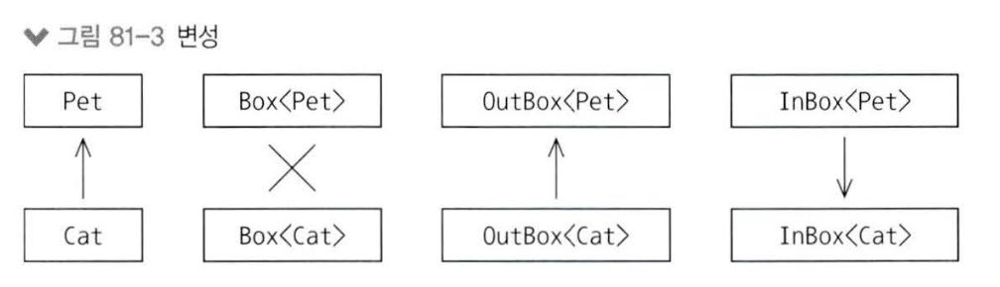
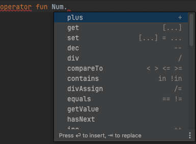

# ✅ 확장 람다

---

- 확장 함수와 비슷하며 차이는 함수가 아니라 람다라는 점임
- 코틀린에서는 확장 람다를 수신 객체가 지정된 함수 리터럴이라 하는데, 함수 리터럴은 람다와 익명함수 를 모두 포함하기에 수신 객체가 지정된 람다 → 확장 람다 라고 부름.

```kotlin
// va: (String, Int) -> String 타입의 일반 람다.
val va: (String, Int) -> String = { str, n ->
    str.repeat(n) + str.repeat(n)
}

// vb: String.(Int) -> String 타입의 확장 람다.
val vb: String.(Int) -> String = {
    this.repeat(it) + this.repeat(it)
}

fun main() {
    println(va("Vanbo", 2)) // VanboVanboVanboVanbo
    println("Vanbo".vb(2)) // VanboVanboVanboVanbo
}
```

- `va`: 람다에 두 개의 인자를 직접 전달하여 호출 (`va("Vanbo", 2)`).
    - `this`를 사용하지 않음. 명시적으로 전달된 `str`을 사용.
- `vb`: 람다를 호출할 때, `String` 객체에서 확장 함수처럼 호출 (`"Vanbo".vb(2)`).
    - `this`를 사용해 확장 함수의 주 객체(`String`)를 참조.

- 확장 함수와 마찬가지로 확장 함수도 여러 파라미터를 받을 수 있음

    ```kotlin
    val zero: Int.() -> Boolean = {
        this == 0;
    }
    
    val one: Int.(Int) -> Boolean = {
        this == it;
    }
    
    val two: Int.(Int, Int) -> Boolean = { num1, num2 ->
        this == num1 * num2;
    }
    
    val three: Int.(Int, Int, Int) -> Boolean = { num1, num2, num3 ->
        this == num1 * num2 * num3;
    }
    
    fun main() {
        println(0.zero())
    
        // 아래 두 방식은 동일함
        println(one(2, 3)) // 첫번 째 인자가 this
        println(2.one(3)) // 2가 this로 됨
    
        println(6.three(1,2,3))
    
    }
    ```

    - `one(2, 3)` 와 `2.one(3)` 은 동일한 표현방법이며 같은 호출 함수를 의미함.
        - `one(2, 3)` 에서 `2`가 this, 람다 표현식에 전달한 인자는 `3`이됨
        - `2.one(3)` 은 `2` 가 this, 람다 표현식에 전달할 인자는 `3` 이됨

### 확장 람다의 일반적인 표현법

```kotlin
class A {
    fun af() = 1
}

class B {
    fun bf() = 2
}

fun f1(lambda: (A, B) -> Int) =
    lambda(A(), B())

fun f2(lambda: A.(B) -> Int) =
    A().lambda(B())

fun main() {
    val f1 = f1 { aa, bb -> aa.af() + bb.bf() }
    val f2 = f2 { af() + it.bf() }

    println(f1) // 3
    println(f2) // 3
}
```

- **`f1` 함수**: `(A, B) -> Int` 타입의 람다를 인자로 받음. 즉,  `A`와 `B` 객체를 받아서 `Int` 값을 반환함. `f1` 함수는 `A`와 `B` 객체를 생성하고, 이 객체들을 람다에 전달하여 실행
- **`f2` 함수**: `A.(B) -> Int` 타입의 확장 함수 람다를 인자로 받음. 즉, `A` 클래스의 확장 함수로서 `B` 객체를 파라미터로 받아 `Int` 값을 반환함. `f2` 함수는 `A` 객체를 생성하고, 이 객체에서 확장 함수 람다를 호출하여 실행.

> 확장 람다의 반환 타입이 Unit이면, 람다 본문이 만들어낸 결과는 무시된다.
람다 본문의 마지막 식의 값을 무시하는 것이며, return 으로 Unit이 아닌 값을 반환하면 타입 오류가 발생함
>

- 일반 람다를 파라미터로 받는 위치에 확장 람다를 전달할 수도 있음. 이때 두 람다의 파라미터 목록이 서로 호환되어야 함

    ```kotlin
    fun String.transform1(
        n: Int, lambda: (String, Int) -> String
    ) = lambda(this, n)
    
    fun String.transform2(
        n: Int, lambda: String.(Int) -> String
    ) = lambda(this, n)
    
    val duplicate: String.(Int) -> String = {
        repeat(it)
    }
    
    val alternate: String.(Int) -> String = {
        toCharArray()
            .filterIndexed { i, _ -> i % it == 0 }
            .joinToString("")
    }
    
    fun main() {
        println(
            "hello".transform1(5, duplicate)
            .transform2(3, alternate)
        ) // hleolhleo
        println(
            "hello".transform2(5, duplicate)
                .transform1(3, alternate)
        ) // hleolhleo
    }
    ```


- `::` 를 사용하면 확장 람다가 필요한 곳에 함수 참조를 넘길 수 있음

    ```kotlin
    fun Int.d1(f: (Int) -> Int) = f(this) * 10
    
    fun Int.d2(f: Int.() -> Int) = f() * 10
    
    fun f1(n: Int) = n + 3
    
    fun Int.f2() = this + 3
    
    fun main() {
        74.d1(::f1) // 740
        74.d2(::f1) // 740
        74.d1(Int::f2) // 740
        74.d2(Int::f2) // 740
    }
    ```

    - 확장 함수에 대한 참조는 확장 람다와 타입이 같으므로 `Int::f2`는 `Int.() → Int`임
    - `74.d1(Int::f2)` 호출에서 일반 람다 파라미터를 요구하는 d1()에 확장함수를 넘김

- 람다 대신 익명 함수 구문도 가능

    ```kotlin
    fun exec(
        arg1: Int, arg2: Int,
        f: Int.(Int) -> Boolean
    ) = arg1.f(arg2)
    
    fun main() {
        exec(10, 2, fun Int.(d: Int): Boolean {
            return this % d == 0
        }) // true
    }
    ```


### 코틀린 라이브러리의 확장 람다 예시

- 예를 들어 StringBuilder는 toString()을 적용해 불변 String을 만들어낼 수 있는 가변 객체다.
- 반대로 더 현대적인 buildString()은 확장 람다를 인자로 받음.
    - **buildString() :**  자체적으로 StringBuilder 객체를 생성하고, 확장 람다를 생성한 StringBuilder 객체에 적용한 다음, toString()을 호출해 문자열을 얻음

```kotlin
private fun messy(): String {
    val built = StringBuilder() // [1]
    built.append("ABCs: ")
    ('a'..'x').forEach { built.append(it) }
    return built.toString() // [2]
}

private fun clean() = buildString {
    append("ABCs: ")
    ('a'..'x').forEach { append(it) }
}

private fun cleaner() =
    ('a'..'x').joinToString("", "ABCs: ")

fun main() {
    println( messy() ) // ABCs: abcdefghijklmnopqrstuvwx
    println( clean() ) // ABCs: abcdefghijklmnopqrstuvwx
    println( cleaner() ) // ABCs: abcdefghijklmnopqrstuvwx
}
```

- messy() 안에서는 직접 StringBuilder를 생성하고(`[1]`), 결과를 직접 알아내야함(`[2]`)
- clean()에서 buildString()을 사용하면 append() 호출의 수신 객체를 직접 만들고 관리할 필요가 없음
- cleaner()는 때로 문자열 빌더를 사용하는 코드를 배제하고 더 직접적인 해법을 찾아낼 수 있다는 사실을 보여줌

# ✅ 영역 함수(Scope Functions)

---

- 영역 함수는 객체의 이름을 사용하지 않아도 그 객체에 접근할 수 있는 영역을 만들어주는 함수임
  → 객체를 다루는 방식을 간소화하고 코드 가독성을 높혀줌
- `let()`, `run()`, `with()`, `apply()`, `alse()`
- 문맥 객체를 it이나 this로 다루는 차이는 각 함수가 어떤 값을 반환하는지에 따라 달라짐

### 1. let

- **객체를 `it`으로 접근**하고, **람다의 마지막 식의 값을 반환**
- 객체를 인자로 받아서 특정 작업을 수행한 후, 결과를 반환하고자 할 때 유용

```kotlin
val let1 = Tag(1).let {
    it.s = "let : ${it.n}" // 객체의 속성을 `it`으로 접근해서 수정
    it.increment() // 수정된 값을 반환 (n이 1 증가)
}
println(let1) // 2
```

### 2. run

- **객체를 `this`로 접근**하고, **람다의 마지막 식의 값을 반환**
- 주로 객체의 초기화와 관련된 작업을 하면서 결과값을 반환할 때 사용

```kotlin
val run = Tag(3).run {
    s = "run: ${n}" // `this`를 사용해 객체의 속성을 직접 접근하고 수정
    increment() // 수정된 값을 반환 (n이 1 증가)
}
println(run) // 4
```

### 3. with

- **지정된 객체를 `this`로 접근**하고, **람다의 마지막 식의 값을 반환**
- 보통 특정 객체에서 여러 작업을 수행할 때 사용

```kotlin
val with = with(Tag(4)) {
    s = "with : ${n}" // `this`를 사용해 객체의 속성을 직접 접근하고 수정
    increment() // 수정된 값을 반환 (n이 1 증가)
}
println(with) // 5
```

### 4. apply

- **객체를 `this`로 접근**하고, **수정된 '객체' 자체를 반환**
- 주로 객체의 속성을 변경한 후 그 객체를 다시 반환해야 할 때 사용

```kotlin
val apply = Tag(5).apply {
    s = "apply: ${n}" // `this`로 객체의 속성 수정
    increment() // n이 1 증가하지만, 객체 자체를 반환
}
println(apply) // Tag(n=6, s="apply: 5")
```

### 5. also

- **객체를 `it`으로 접근**하고, **수정된 '객체' 자체를 반환**
- 객체를 수정하면서 객체 자체를 반환해야 할 때 사용하며, `apply`와 비슷하지만 `it`을 사용

```kotlin
val also1 = Tag(6).also {
    it.s = "also: ${it.n}" // `it`으로 객체의 속성 수정
    it.increment() // n이 1 증가하지만, 객체 자체를 반환
}
println(also1) // Tag(n=7, s="also: 6")
```

### 핵심 요약

- `let`: `it`으로 접근, 마지막 식의 **값**을 반환
- `run`: `this`로 접근, 마지막 식의 **값**을 반환
- `with`: `this`로 접근, 마지막 식의 **값**을 반환
    - run은 확장 함수 with는 일반 함수로 두 함수는 같은 동작을 함.
      수신 객체가 null이 될 수 있거나 연쇄 호출이 필요하면 run을 사용할 것.
- `apply`: `this`로 접근, **객체** 자체를 반환
- `also`: `it`으로 접근, **객체** 자체를 반환

## 전통적인 null 체크 시 let과 세이프 콜을 함께 사용법

- `?.` 을 사용하면 영역 함수를 널이 될 수 있는 수신 객체에도 적용할 수 있음
- `let` 에서 널이 될 수 없는 수신 객체는 람다 내부에서 널이 될 수 없는 it이 됨

코틀린에서는 `?.` 연산자를 사용해 객체가 `null`인지 아닌지 쉽게 확인할 수 있습니다. 이때 `?.let`을 사용하면, 객체가 `null`이 아닐 때에만 `let` 블록 내부의 코드가 실행됩니다. 이렇게 하면 `null` 체크를 간결하게 처리할 수 있습니다.

### 예제 1: null 체크를 간단하게 처리

```kotlin
val name: String? = "Kotlin"

name?.let {
    println("Name is not null: $it")
}
```

- `name`이 `null`이 아니면 `let` 블록이 실행되어 "Name is not null: Kotlin"이 출력되고, `name`이 `null`이라면 `let` 블록은 아예 실행되지 않음

### 예제 2: null이 아닐 때에만 특정 작업 수행

```kotlin
val name: String? = null

name?.let {
    println("Name is not null: $it")
}
```

- 이 경우, `name`이 `null`이기 때문에 `let` 블록이 실행되지 않고, 출력도 없음

## 문맥 객체에 대한 안전한 접근 연산

- 안전한 접근 연산을 사용하면 영역에 들어가기 앞서 null 검사를 수행함
- 안전한 접근 연산을 사용하지 않으면 영역 함수 안에서 개별적으로 null을 검사해야함

```kotlin
class Gnome(val name: String) {
    fun who() = "Gnome: ${name}"
}

fun whichGnome(gnome: Gnome?) {
    println(gnome?.name)
    gnome?.let { println(it.who()) }
    gnome?.run { println(who()) }
    gnome?.apply { println(who()) }
    gnome?.also { println(it.who()) }
}

fun main() {
    whichGnome(Gnome("John"))
    println("====")
    whichGnome(null)
}

// 출력
John
Gnome: John
Gnome: John
Gnome: John
Gnome: John
====
null
```

## 영역 함수는 연쇄 호출에서 널이 될 수 있는 타입과 함께 사용 가능함

```kotlin
data class User(
    var name: String?,
    var email: String?,
    var age: Int?
)

fun main() {
    val user: User? = User("Alice", null, 25)

    user?.let {
        it.name = it.name?.uppercase() // name이 null이 아닌 경우 대문자로 변환
    }?.apply {
        email = "alice@example.com" // email 설정
    }?.run {
        println("User Details: Name: $name, Email: $email, Age: $age")
    }
}

```

- **`let` 사용**:
    - `user` 객체가 `null`이 아닌 경우에만 실행
    - `let` 블록 내에서는 `it`으로 `user` 객체를 참조하여, `name` 속성을 대문자로 변환함. `name` 자체도 `null`일 수 있으므로 안전하게 `?.uppercase()`를 사용
- **`apply` 사용**:
    - `let` 블록이 끝난 후, `apply` 블록이 실행
    - `apply`는 객체를 반환하므로, 이후 다른 스코프 함수와 연쇄 호출할 수 있음. 여기서는 `email` 속성을 설정
- **`run` 사용**:
    - `apply` 블록이 끝난 후, `run` 블록이 실행
    - `run` 블록 내에서는 `this`로 `user` 객체를 참조하여, 사용자 정보를 출력함

## 영역 함수의 인라인 최적화

### **핵심 개념:**

1. **람다**: 코드 블록을 변수처럼 사용할 수 있게 하는 기능. 람다를 함수의 인자로 전달하면, 실행 시점에 약간의 비용이 추가된다.
2. **인라인(inline)**: 함수 호출을 실제 코드로 교체해주는 최적화 기법. 함수 호출에 따르는 비용을 줄여줌

### **왜 인라인이 중요한가?**

- **일반적인 함수 호출**은 호출 시 약간의 비용이 발생하는데,
- **람다를 인자로 전달할 때**, 이 비용이 더 커질 수 있음. 예를 들어, 람다가 호출될 때마다 추가 객체가 만들어짐
- **인라인 함수**로 만들면, 이 모든 호출 비용을 줄일 수 있고, 함수 호출 부분을 실제 코드로 대체해서 **람다의 실행 비용을 없앨 수 있음**

### **어떻게 작동하는가?**

- **인라인 함수**를 사용하면, 컴파일러가 함수 호출을 함수 본문으로 교체한다. 즉, 함수가 호출되는 곳에 실제 코드가 들어가게 됨
- **람다도 인라인**으로 처리되기 때문에, 람다를 사용하면서 추가적인 객체가 만들어지지 않게 됨

### **장점:**

- **성능 향상**: 작은 함수에서는 함수 호출 비용을 줄여 성능을 향상시킬 수 있음
- **안심하고 사용**: 인라인으로 인해 성능 문제가 없기 때문에, 더 자유롭게 스코프 함수 같은 기능을 사용할 수 있음

### **주의할 점:**

- **함수가 클 경우**: 큰 함수를 인라인하면, 코드가 중복되어 최종 코드 크기가 커질 수 있습니다. 이 경우 인라인의 이점이 줄어들 수 있음
- **람다를 변수에 담는 경우**: 람다를 바로 인자로 전달할 때만 인라인 최적화가 적용되므로 람다를 변수에 담아 전달하면 여전히 객체가 생성됨

### **요약:**

- **인라인 함수**는 작은 함수의 성능을 높이고, 람다를 사용할 때 발생하는 추가 비용을 줄여준다.
- **성능을 신경 써야 할 때** 특히 유용하며, 불필요한 성능 저하 없이 코드를 간결하게 유지할 수 있다.

# ✅ 81. 제네릭스 만들기

---

## Any

- `Any` 는 코틀린 클래스 계층의 조상으로 모든 클래스를 담을 수 있다. (자바의 `Object` 와 같은 역할)
- `Any` 멤버 함수는 `equals()`, `hashCode()`, `toString()` 뿐이므로 모든 객체를 담을 수 있지만 구체적인 연산을 수행할 수는 없음.

```kotlin
class Person {
    fun speak() = "Hi!"
}

class Dog {
    fun bark() = "Ruff!"
}

class Robot {
    fun communicate() = "Beep!"
}

fun talk(speaker: Any) =
    when (speaker) {
        is Person -> speaker.speak()
        is Dog -> speaker.bark()
        is Robot -> speaker.communicate()
        else -> "Not a talker"
    }

fun main() {
    talk(Person()) // "Hi!"
    talk(Dog()) // "Ruff!"
    talk(Robot()) // "Beep!"
    talk(11) // "Not a talker"
}
```

## 제네릭스 정의하기

- 다이아몬드 연산자(`<>`)를 통해 제네릭 함수나 타입을 정의할 수 있음

```kotlin
// 제네릭 함수: 입력된 인자의 타입을 그대로 반환하는 함수
fun <T> gFunction(arg: T): T = arg

// 제네릭 클래스: 클래스의 멤버 변수와 메서드에서 타입을 제네릭으로 사용할 수 있는 클래스
class GClass<T>(val x: T) {
    fun f(): T = x
}

// 제네릭 멤버 함수: 클래스 내에서 제네릭 타입을 사용하는 함수
class GMemberFunction {
    fun <T> f(arg: T): T = arg
}

// 제네릭 인터페이스: 제네릭 타입을 가지는 인터페이스
interface GInterface<T> {
    val x: T
    fun f(): T
}

// 제네릭 인터페이스 구현체: 제네릭 타입을 지정해 인터페이스를 구현하는 클래스
class GImplementation<T>(
    override val x: T
) : GInterface<T> {
    override fun f(): T = x
}

// 구체적인 타입을 사용한 인터페이스 구현체: String 타입을 지정하여 인터페이스를 구현
class ConcreteImplementation : GInterface<String> {
    override val x: String
        get() = "x"
    override fun f() = x
}

fun main() {
    // 제네릭 함수 호출: 인자로 다른 타입을 전달할 수 있음
    gFunction("Yellow") // String 타입
    gFunction(11)       // Int 타입
    gFunction(Dog()).bark() // Dog 타입을 반환하므로 bark() 메서드 호출 가능
    
    // 제네릭 클래스 사용: 다른 타입으로 인스턴스화 가능
    GClass("Cyan").f()   // String 타입
    GClass(Dog()).f()    // Dog 타입
    GClass(Dog()).f().bark() // Dog 타입이므로 bark() 메서드 호출 가능
    
    // 제네릭 멤버 함수 호출: 클래스 내에서 제네릭 타입의 함수 사용
    GMemberFunction().f("Amber") // String 타입
    GMemberFunction().f(11)      // Int 타입
    GMemberFunction().f(Dog()).bark() // Dog 타입이므로 bark() 메서드 호출 가능
    
    // 제네릭 인터페이스 구현체 사용: 다른 타입으로 인터페이스 구현 가능
    GImplementation("X").f()    // String 타입
    GImplementation(11).f()     // Int 타입
    GImplementation(Dog()).f().bark() // Dog 타입이므로 bark() 메서드 호출 가능
    
    // 구체적인 타입으로 구현한 인터페이스 사용
    ConcreteImplementation().f() // String 타입
    ConcreteImplementation().x   // String 타입
}
```

## 타입 정보 보존하기

### **타입 소거(Type Erasure) →  타입 이레이저**

- 제네릭을 통해 타입 안전성을 제공하면서 다양한 타입을 유연하게 처리할 수 있음
- 제네릭 클래스나 제네릭 함수의 내부 코드는 **컴파일 시점**에 실제 타입을 알 수 없으며 제네릭을 사용하는 코드는 컴파일 시에 제네릭 타입을 구체적인 타입으로 변환하게 되는데, 이 과정에서 제네릭 타입 정보가 삭제되고, 그 자리에 구체적인 타입이 들어간다. 이 작업을 **타입 소거**(Type Erasure)라함
- 이를 통해 제네릭 기능이 제공하는 타입 안전성과 코드의 유연성, 재사용성을 유지하면서도, 런타임 오버헤드를 줄일 수 있음

### **제네릭을 사용하는 일반적인 예: 컨테이너 클래스**

- 제네릭스의 대표적인 사용 예는 다른 객체를 담는 **컨테이너 클래스**임
- 예를 들어, `Car` 타입의 객체를 하나 담을 수 있는 `CarCrate`라는 클래스

    ```kotlin
    class Car {
        override fun toString() = "Car"
    }
    
    class CarCrate(private var c: Car) {
        fun put(car: Car) {
            c = car
        }
    
        fun get(): Car = c
    }
    ```

    - `Car` 객체를 담을 수 있으며, `get()`을 호출하면 `Car` 타입의 값을 반환

### **제네릭 클래스로의 일반화**

- `Crate<T>`로 일반화하여, `T` 타입의 값을 담을 수 있는 제네릭 클래스로 만들 수 있음

    ```kotlin
    open class Crate<T>(private var contents: T) {
        fun put(item: T) {
            contents = item
        }
    
        fun get(): T = contents
    }
    ```

    - `Car` 뿐만 아니라 다른 타입에 대해서도 활용할 수 있으며, `T` 타입의 값만 `Crate`에 넣고 꺼낼 수 있도록 보장함.

### **제네릭 확장 함수의 활용: `map()`**

- 제네릭 확장 함수를 사용해 `Crate`에 `map()` 함수를 추가할 수 있음
    - `map()` : 입력 시퀀스의 모든 원소에 주어진 함수 `f`를 적용해 새로운 값을 생성

    ```kotlin
    fun <T, R> Crate<T>.map(f: (T) -> R): List<R> = listOf(f(get()))
    ```

    - `map()` 함수는 `T` 타입의 입력 값을 받아, `R` 타입의 결과 값을 생성하여 하나의 `List<R>`로 반환
- 예를 들어, `Crate<Car>()`에서 `map()` 함수를 사용해 `Car` 객체를 문자열로 변환할 수 있음

    ```kotlin
    Crate(Car()).map { it.toString() + "x" } eq "[Carx]"
    ```


## 파라미터 제약

- 제네릭을 사용할 때, 제네릭 타입 인자가 특정 클래스를 상속해야 한다고 명시하는 제약을 설정할 수 있음
- 예를 들어, `<T: Base>`는 `T`가 `Base` 타입이거나 `Base`에서 파생된 타입이어야 함을 의미함
- 제네릭 함수나 클래스 내부에서 해당 타입의 프로퍼티와 메서드에 접근할 수 있도록 보장할 수 있고, 이를 통해 타입 안전성을 유지하면서도 유연한 코드를 작성할 수 있음
- 제네릭과 일반 타입의 차이
    - **제네릭 제약 사용**: 해당 타입의 메서드나 프로퍼티에 접근할 수 있으며, 반환 타입도 제네릭 타입으로 유지할 수 있음
    - **일반 타입 사용**: 일반적인 다형성을 사용하면 반환 타입이 기반 타입으로 업캐스트되기 때문에, 반환된 객체의 구체적인 타입을 알 수 없어서 메서드 호출이나 프로퍼티 접근에 제한이 생김.

```kotlin
interface Disposable {
    val name: String
    fun action(): String
}

class Compost(override val name: String) : Disposable {
    override fun action() = "Add to composter"
}

class Donation(override val name: String) : Disposable {
    override fun action() = "Call for pickup"
}

class Recyclable(override val name: String) : Disposable {
    override fun action() = "Put in bin"
}

class Landfill(override val name: String) : Disposable {
    override fun action() = "Put in dumpster"
}

```

```kotlin
open class Crate<T : Disposable>(
    private var contents: T
) {
    fun put(item: T) {
        contents = item
    }

    fun get(): T = contents
}
```

- `Crate<T>` 제네릭 클래스를 사용특정 타입의 메서드와 프로퍼티에 안전하게 접근할 수 있음
- 일반적인 다형성에서는 반환 타입이 `Disposable`로 제한되며, 특정 타입에 대해 메서드를 호출할 수 없음.  반면에 제네릭을 사용하면 구체적인 타입을 반환할 수 있어, 타입 안전성과 코드의 가독성이 증가함

## 타입 소거

- 코틀린 설계자 들은 자바의 결정에 따라 타입 소거를 사용하기로 했고 이유는 두가지
    - 자바 호환성을 유지한다.
    - 타입 정보를 유지하면 부가 비용이 발생하는데 제네릭 타입 정보를 저장할 경우, `List`나 `Map` 같은 제네릭 컬렉션의 메모리 사용량이 증가함.
      예를 들어, `Map.Entry`는 제네릭 객체이므로, 모든 키와 값에 타입 정보를 저장하면 메모리 사용이 크게 늘어난다.

## **함수의 타입 인자에 대한 실체화 <**`reified`**>**

- `reified` 키워드는 코틀린에서 제네릭 타입의 타입 정보를 런타임 시점에 활용할 필요가 있을 때 사용한다.
- 제네릭 타입 정보는 타입 이레저에 의해 컴파일 시점에 소거되기 때문에, 런타임에 타입 정보를 사용할 수 없다.
- `reified` 를 사용하면 타입 정보를 유지할 수 있어서 런타임에서도 제네릭 타입에 대한 정보를 확인하거나 사용할 수 있다.
- `reified`를 사용하려면 제네릭 함수를 `inline`으로 선언해야 한다.

- 예를 들어, `a()` 함수가 클래스 정보를 필요로 할 때

    ```kotlin
    import kotlin.reflect.KClass // Kotlin 클래스를 표현하는 클래스
    
    fun <T: Any> a(kClass: KClass<T>) {
        // KClass<T>를 사용함
    }
    ```

  `b()` 함수에서 `a()`를 호출하려면 제네릭 타입 정보를 전달해야 하지만, 타입 소거 때문에 아래 코드는 컴파일 되지 않음

    ```kotlin
    // 타입 소거로 인해 컴파일되지 않음
    // fun <T: Any> b() = a(T::class)
    ```


- 자바에서는 수작업으로 타입 정보를 전달하는 방법이 있지만, 코틀린에서는 `reified`를 사용하여 이 문제를 해결할 수 있다.
  `reified`를 사용하려면 제네릭 함수를 `inline`으로 선언해야 함

    ```kotlin
    inline fun <reified T: Any> d() = a(T::class)
    val kd = d<K>()
    ```

- `reified`를 사용하면 런타임 시점에 타입 정보를 사용할 수 있고, 함수 본문 안에서 이를 활용할 수 있다. 예를 들어, `is` 연산자를 제네릭 파라미터 타입에 적용할 수 있음

    ```kotlin
    inline fun <reified T> check(t: Any) = t is T
    
    fun main() {
        check<String>("1") eq true
        check<Int>("1") eq false
    }
    ```

  `reified`와 제약을 함께 사용하는 예시는 다음과 같음

    ```kotlin
    	inline fun <reified T : Disposable> select() =
        items.filterIsInstance<T>().map { it.name }
    
    fun main() {
        select<Compost>() eq "[Orange Peel, Apple Core]"
        select<Donation>() eq "[Couch, Clothing]"
        select<Recyclable>() eq "[Plastic, Metal, Cardboard]"
        select<Landfill>() eq "[Trash]"
    }
    ```

  이 경우, `filterIsInstance()`는 `reified` 키워드를 사용하여 타입 정보를 유지할 수 있도록 정의되어 있다.


### `reified`를 사용하는 주요 경우

1. **런타임 타입 확인**: 제네릭 타입의 인스턴스인지 확인할 때 유용하다. 예를 들어, `is` 연산자를 사용하여 객체가 특정 제네릭 타입의 인스턴스인지 검사할 수 있음

    ```kotlin
    inline fun <reified T> isInstance(obj: Any): Boolean {
        return obj is T
    }
    
    fun main() {
        println(isInstance<String>("Hello")) // true
        println(isInstance<Int>("Hello"))    // false
    }
    ```


1. **타입 기반 필터링**: 컬렉션에서 특정 타입의 객체만 필터링할 때 사용

    ```kotlin
    inline fun <reified T> List<Any>.filterByType(): List<T> {
        return this.filterIsInstance<T>()
    }
    
    fun main() {
        val items = listOf("String", 1, 2.5, "Another String")
        val strings = items.filterByType<String>()
        println(strings) // [String, Another String]
    }
    ```


1. **타입 기반 인스턴스 생성**: 제네릭 타입의 클래스를 동적으로 생성할 때 유용

    ```kotlin
    inline fun <reified T: Any> createInstance(): T {
        return T::class.java.getDeclaredConstructor().newInstance()
    }
    
    fun main() {
        val instance = createInstance<String>()
        println(instance.javaClass) // class java.lang.String
    }
    ```


1. **타입 정보 전달**:
    - 제네릭 함수에서 타입 정보를 다른 함수로 전달할 때 사용

    ```kotlin
    inline fun <reified T: Any> printClassName() {
        println(T::class.simpleName)
    }
    
    fun main() {
        printClassName<String>() // String
        printClassName<Int>()    // Int
    }
    ```


## 타입 변성

```kotlin
class Box<T>(private var contents: T) {
    fun put(item: T) { contents  = item}
    fun get(): T = contents
}

class InBox<in T> (private var contents: T) {
    fun put(item: T) { contents  = item}
}

class OutBox<out T> (private var contents: T) {
    fun get(): T = contents
}
```

- `in T` : 클래스 멤버 함수가 T 타입 값을 인자로만 받고, T 타입은 값을 반환하지 않겠다는 뜻.
    - 즉, T 객체가 InBox 안으로 들어갈 수는 있지만, 밖으로 나올 수 없음
- `out T` : 클래스 멤버 함수가 T 타입 값을 반환하기만 하고 T 타입 값을 인자로 받지 않는다는 뜻.
    - 즉, T 객체가 OutBox 안으로 나올 수는 있지만, 들어올 수는 없음

### 타입변성이 필요한 이유

```kotlin
open class Pet
class Cat : Pet()
class Dog : Pet()
```

- Cat, Dog 모두 Pets의 하위 타입으로 `Box<Pet>` 타입 변수에 `Box<Cat>` 객체를 대입할 수 있어야 함
- 예를 들어, Cat의 Box를 Pet의 Box에 대입하거나 Any의 Box에 대입하는 것이 가능해야함

```kotlin
val catBox = Box<Cat>(Cat())
//val petBox: Box<Pet> = catBox // 컴파일 에러
//val anyBox: Box<Any> = catBox // 컴파일 에러
```

- catBox를 petBox에 넣게되면 dogBox도 petBox에 넣을 수 있으므로 petBox는 더이상 catBox가 아니게 되어버린다. 따라서 컴파일 에러가 발생함
- catBox를 anyBox에 넣게되면 모든 객체를 anyBox에 넣을 수 있으므로 petBox는 더이상 catBox가 아니게 되어버린다. 따라서 컴파일 에러가 발생함

### 공변성 <`out` >

```kotlin
val outCatBox: OutBox<Cat> = OutBox(Cat())
val outPetBox: OutBox<Pet> = outCatBox
val outAnyBox: OutBox<Any> = outCatBox
```

- `out` 을 사용한 OutBox에서 처럼 put() 사용을 막으면  `Dog` 객체를 `outCatBox`에 넣을 수 없으므로, `outPetBox`나 `outAnyBox`도 안전하게 사용될 수 있음
- `OutBox<out T>`에 붙은 `out` 애너테이션이 put 함수 사용을 허용하지 않으므로 컴파일러는 `OutBox<Cat>` 을 `OutBox<Pet>` 이나 `OutBox<Any>` 에 대입하도록 허용함
- 이것을 **공변성** 이라고한다.
    - **공변성 :** 하위 타입을 상위 타입으로 대입할 수 있도록 허용한다. → 읽기 전용

### 반공변성 <`in`>

```kotlin
val inBoxAny: InBox<Any> = InBox(Any())
val inBoxPet: InBox<Pet> = inBoxAny
val inBoxCat: InBox<Cat> = inBoxAny
val inBoxDog: InBox<Dog> = inBoxAny

fun main() {
    inBoxAny.put(Any())
    inBoxAny.put(Pet())
    inBoxAny.put(Dog())
    inBoxAny.put(Cat())
    
    inBoxPet.put(Pet())
    inBoxPet.put(Cat())
    inBoxPet.put(Dog())
    
    inBoxCat.put(Cat())
    inBoxDog.put(Dog())
}
```

- `InBox〈Any〉`에는 Any. Pet. Cat. Dog을 `put()`해도 안전하며 `InBox〈Pet〉`에는 Pet, Cat. Dog 을 `put()`해도 안전하다. inBoxCat과 inBoxDog은 각각 Cat과 Dog만을 받을 수 있다.
- `in` 키워드는 제네릭 타입이 **반공변성**을 가지도록 해준다.
    - **반공변성 :** 상위 타입을 하위 타입으로 대입할 수 있도록 허용합니다.
    - **값을 넣는 것**만 가능하며, 이를 통해 타입 안전성이 보장됨



- `Box<T>` : 무공변이다.  Box〈Cat>과 Box<Pet> 사이에 아무런 하위 타입 관계가 없다. 따라서 둘 중 어느쪽도 반대쪽에 대입될 수 없다.
- `OutBox<out T〉` : 공변 이다. OutBox〈Cat〉을 OutBox〈Pet〉으로 업캐스트하는 방향이 Cat을 Pet으로 업캐스트하는 방향과 같은 방향으로 변한다.
- `InBox<in T〉`는 반공변 이다. 즉, InBox〈Pet〉이 InBox〈Cat〉의 하위 타입이다.
InBox〈Pet〉을 InBox〈Cat〉으로 업캐스트하는 방향이 Cat을 Pet으로 업캐스트하는 방향과 반대 방향으로 변한다.

### 코틀린의 라이브러리의 List와 공변성, 반공변성

- **읽기 전용 리스트 (List)**:
  - 코틀린의 `List` 인터페이스는 공변성을 갖음
  - 이는 `List<Cat>`이 `List<Pet>`에 안전하게 대입될 수 있음을 의미

    ```kotlin
    val catList: List<Cat> = listOf(Cat())
    val petList: List<Pet> = catList  // OK: List는 공변적임
    ```


- **변경 가능한 리스트 (MutableList)**:
  - 코틀린의 `MutableList`는 무공변성을 갖음
  - 이는 `MutableList<Cat>`을 `MutableList<Pet>`에 대입할 수 없음을 의미함

    ```kotlin
    var mutablePetList: MutableList<Pet> = mutableListOf(Cat())
    mutablePetList.add(Dog())  // OK
    ```


### 함수의 공변성과 무공변성

- **함수의 반환 타입은 공변적**이다.
  - 반환 타입이 `Parent`인 함수가 있다면, 이를 오버라이드할 때 `Child`와 같은 더 구체적인 타입을 반환할 수 있다

    ```kotlin
    interface Parent
    interface Child : Parent
    
    interface X {
        fun f(): Parent
    }
    
    interface Y : X {
        override fun f(): Child  // OK: 반환 타입은 공변적
    }
    ```


# ✅ 82. 연산자 오버로딩

---

- **연산자 오버로딩 :** 특정 연산자(`+`)를 새로 만든 타입에 대해 특별한 방식으로 동작하도록 재정의하는 기능

```kotlin
data class Num(val n: Int)

operator fun Num.plus(rval: Num) =
    Num(this.n + rval.n)

operator fun Num.plus(num: Int) =
    Num(this.n + num)

fun main() {
    val num1 = Num(4) + Num(5)
    println(num1.n) // 9
    var num2 = Num(4) + 16
    println(num2.n) // 20
}
```

- `+` 연산자를 오버로딩하여 `Num` 객체끼리 `+` 할 경우 `Num` 객체의 `n` 값을 더해 새로운 `Num` 객체를 반환하도록 오버로딩
- 또 다른 `+` 연산자를 오버로딩하여 `Num`의 `n` 값에 주어진 `Int` 값을 더해 새로운 `Num` 객체를 반환하도록 오버로딩

### `operator` 키워드

- 연산자 오버로딩을 위해서는 함수 앞에 `operator` 키워드를 붙여야 한다. 이 키워드는 함수가 특정 연산자에 대응되는 함수임을 나타낸다.
- IDE에서도 operator 를 붙이면 연산자를 확장할 수 있도록 보여줌



- 연산자를 확장함수로 정의하면 클래스의 private 멤버는 볼 수 없지만, 멤버 함수로 정의하면 private 멤버에 접근할 수 있음

    ```kotlin
    data class Num2(
        private val n: Int
    ) {
        operator fun plus(other: Num2) =
            Num2(this.n + other.n) // private 멤버 this로 접근 가능
    }
    
    operator fun Num2.minus(other: Num2) =
        Num2(this.n + other.n) // Cannot access 'n': it is private in 'Num2'
    ```

## 동등성

- **`==` 연산자** : 두 객체가 같은지 비교할 때 사용되며 코틀린에서는 `==` 연산자가 내부적으로 `equals()` 가 호출됨.
- **`!=` 연산자** : 두 객체가 다른지 비교할 때 사용됩니다. 이 연산자는 `==` 연산자의 결과를 반대로 반환합니다. 즉, `!(a == b)`와 동일한 결과를 반환한다.
- `equals()` : 객체 간의 동등성을 비교하는 함수로 기본적으로 `Any` 클래스에서 제공되며 클래스가 이를 오버라이드하지 않으면 객체의 참조를 비교하는 기본 구현이 사용된다. 즉, 두 객체의 메모리 주소(참조)가 같은지를 비교한다.
  - `equals()` 는 확장 함수로 정의할 수 없는 유일한 연산자이며 반드시 멤버 함수로 오버라이드 되어야함
- **`===` 연산자 :** 두 객체의 참조(메모리 주소)가 같은지를 비교한다. 즉, 두 변수가 동일한 객체를 가리키는지를 판단합니다.
- **`!==` 연산자 :** 는 두 객체의 참조가 다르다는 것을 확인한다.

```kotlin
val a = "Hello"
val b = "Hello"
val c = a

println(a === b) // true (문자열 리터럴은 캐시되어 동일한 객체를 참조할 수 있음)
println(a === c) // true (a와 c는 같은 객체를 참조함)

println(a !== b) // false (a와 b는 동일한 객체를 참조함)
println(a !== c) // false (a와 c는 동일한 객체를 참조함)
```

### 요약

- `==` ****: 값 동등성 비교 (내부적으로 `equals()` 호출)
- `!=` ****: 값 비동등성 비교 (내부적으로 `==`의 반대)
- `equals()`: 객체의 동등성을 비교하는 메서드 (기본적으로 참조 비교, 오버라이드 가능)
- `===` : 참조 동등성 비교 (두 객체가 동일한 메모리 주소를 참조하는지 확인)

## 산술 연산자

- 산술 연산자가 엘비스 연산자 (`?:`) 보다 우선순위가 높기 때문에 괄호를 사용하는 것이 좋다.

    ```kotlin
    fun main() {
        val x: Int? = 1
        val y: Int = 2
        val sum= x ?: 0 + y // 1
        (x ?: 0) + y // 3 
        x ?: (0 + y) // 1
    }
    ```

  - `x ?: 0 + y` :
    - `?:` 보다 `+` 의 우선 순위가 더 높음
    - `x` 가 null인 경우 0 + y 의 결과를 사용 → x = 1 이므로 1 반환
  - `(x ?: 0) + y`  :
    - `x` 가 null인 경우 0으로 치환되고 여기에 y을 더함 → x = 1 이므로 1+2 = 3 반환
  - `x ?: (0 + y)` :
    - `x` 가 null인 경우 0 + y 의 결과를 사용 → x = 1 이므로 1 반환

## 비교 연산자

- `compareTo()` 를 정의하면 모든 비교 연산자를 사용할 수 있음
  - `compareTo()` : 두 객체를 비교하여 비교 결과를 정수로 반환
    - **0을 반환 :** 두 객체가 동일함
    - **양수를 반환 :** 현재 객체가 비교 객체보다 큼
    - **음수를 반환 :** 현재 객체가 비교 객체보다 작음

```kotlin
class E(val v: Int)

operator fun E.compareTo(e: E) =
    v.compareTo(e.v)

fun main() {
    val a = E(1)
    val b = E(2)
    println( a < b) // true  a.compareTo(b) < 0
    println( a > b) // false a.compareTo(b) > 0
}
```

## 범위와 컨테이너

- `rangeTo()` 는 범위를 생성하는 `..` 연산자를 오버로드하고, `contains()`는 값이 범위 안에 들어가는지 여부를 알려주는 `in` 연산을 오버로드한다.

```kotlin
data class E(val v: Int)

data class R(val r: IntRange) {
    override fun toString() = "R($r)"
}

operator fun E.rangeTo(e: E): R = R(v..e.v)

operator fun contains(e: E): Boolean =
    e.v in r

fun main() {
    val a = E(2)
    val b = E(3)
    val r = a..b

    (a in r) eq true   // a는 r 범위 내에 있으므로 true
    (a !in r) eq false // a는 r 범위 내에 있으므로 false
    r eq R(2..3)       // r은 R(2..3)과 같으므로 true
}
```

## 컨테이너 원소 접근

- `get()`과 `set()`은 각괄호(`[]`)를 사용해 컨테이너의 원소를 읽고 쓰는 연산을 정의한다.

```kotlin
data class E(val v: Int)

data class C(val c: MutableList<Int>) {
    override fun toString() = "C($c)"
}

// in 연산자를 오버로딩
operator fun C.contains(e: E): Boolean = e.v in c

// get 연산자를 오버로딩
operator fun C.get(i: Int): E = E(c[i])

// set 연산자를 오버로딩
operator fun C.set(i: Int, e: E) { c[i] = e.v }

fun main() {
    val c = C(mutableListOf(2, 3))
    
    // contains 오버로딩 사용
    (E(2) in c) eq true    // E(2)가 C의 리스트에 포함되므로 true
    (E(4) in c) eq false   // E(4)가 C의 리스트에 포함되지 않으므로 false
    
    // get 오버로딩 사용
    c[1] eq E(3)           // c[1]은 리스트의 두 번째 요소, 즉 3이므로 E(3)
    
    // set 오버로딩 사용
    c[1] = E(4)            // 리스트의 두 번째 요소를 E(4)로 변경
    c eq C(mutableListOf(2, 4)) // c는 이제 C(mutableListOf(2, 4))와 같음
}
```

## 호출 연산자

- 객체 참조 뒤에 괄호를 넣으면 `invoke()`를 호출한다.
- 따라서 `invoke()` 연산자는 객체가 함수처럼 작동하게 만든다.
- `invoke()` 가 받을 수 있는 파라미터 개수는 원하는 대로 정할 수 있다.

```kotlin
class Greeter(val greeting: String) {
    operator fun invoke(name: String) {
        println("${greeting}, ${name} !")
    }
}

fun main() {
    val greeter = Greeter("Hello")
    greeter("World") // Hello, World !
}

```

- `invoke()`를 확장 함수로 정의할 수도 있음.

    ```kotlin
    // String 클래스의 확장 함수로 invoke 정의
    operator fun String.invoke(action: (String) -> Unit) {
        action(this) // 현재 String 인스턴스를 action 함수에 넘깁니다.
    }
    
    fun main() {
        val greet = "Hello"
        
        // String 인스턴스를 함수처럼 호출하며, action 함수에 현재 String 값을 넘김
        greet { str ->
            println("Greeting: $str") // 출력: Greeting: Hello
        }
    }
    
    ```


### 역작은따옴표로 감싼 함수 이름

- 코틀린에서 함수 이름에 특별한 문자나 예약어가 포함되어 있을 역작음따옴표로 감싸서 표현한다.
- 예약어 `if` 로 함수명 만들 경우

    ```kotlin
    // 역작은따옴표를 사용하여 예약어와 동일한 함수 이름 정의
    fun `if`(value: Int): String {
        return if (value > 0) "Positive" else "Non-positive"
    }
    
    fun main() {
        println(`if`(10)) // 출력: Positive
        println(`if`(-1)) // 출력: Non-positive
    }
    ```

- 예약어 `in` 을 사용할 경우

    ```kotlin
    fun main() {
        BufferedReader(System.`in`).use { br -> 
            val str = br.readLine()
        }
    }
    
    ```


# ✅ 83. 연산자 사용하기

---

- 실전에서 연산자를 오버로드하는 경우는 드물며 보통 직접 라이브러리를 만들때만 사용함
- 사실 개발자는 오버로드된 연산자를 자연스럽게 쓰고 있음

    ```kotlin
    fun main() {
        val list = MutableList(10) { 'a' + it } // 'a'부터 시작하여 순서대로 문자 추가
        
        // get
        list[7] eq 'h' // operator get()
        list.get(8) eq 'i' // 명시적 호출
        
        // set
        list[9] = 'x' // operator set()
        list.set(9, 'x') // 명시적 호출
        
        // contain
        ('d' in list) eq true // operator contains()
        list.contains('e') eq true // 명시적 호출
    }
    
    ```

  - 코틀린에서 리스트에 `[]` 로 접근하고 `=` 으로 element를 설정할 수 있는 것 모두 연산자 오버로딩이 되었기 때문임

    ```kotlin
    val mutableList = mutableListOf(1, 2, 3)
        mutableList += 4 // operator plusAssign()
        mutableList.plusAssign(4) // 명시적 호출
    ```

  - 그밖에도 많은 오버로딩된 연산자를 사실 쓰고 있음

## 구조분해 연산자

- 구조 분해를 위해 코틀린이 componentN 함수를 호출해준다.

    ```kotlin
    class Duo(
        private val x: Int,
        private val y: Int
    ) {
        operator fun component1(): Int {
            return x
        }
    
        operator fun component2(): Int {
            return y
        }
    }
    
    fun main() {
        val (a, b) = Duo(10, 20)
        println(a) // 10
        println(b) // 20
    }
    ```


- 같은 방법으로 Map에도 적용이 가능한데, Map의 Entry 타입에는 component1(), component2() 멤버 함수가 정의되어 있음

    ```kotlin
    fun main() {
        val map = mapOf(1 to "one", 2 to "two", 3 to "three")
        for ((ket,value) in map) {
            println("$ket -> $value")
        }
    
        // 위 구조분해는 사실 아래와 같이 동작함
        for (entry in map) {
            val key = entry.component1()
            val value = entry.component2()
            println("$key -> $value")
        }
    }
    ```


- data 클래스는 자동으로 componentN()을 만들어주기 때문에 모든 data 클래스에서 구조 분해 문법을 사용할 수 있음

    ```kotlin
    data class Student(
        val name: String,
        val age: Int
    ) {
        // 컴파일러가 다음 두 함수를 자동 생성함
        // fun component1() = name
        //fun component2() = age
    }
    
    fun main() {
        val student = Student("John", 34)
        val (name, age) = student
        println("$name, $age") // John, 34
    }
    ```


# ✅ 84. 프로퍼티 위임

---

- `by` 키워드를 사용하면 프로퍼티를 위임과 연결할 수 있다.

```kotlin
val(또는 var) 프로퍼티이름 by 위임객체이름
```

- 프로퍼티가 `val` 인 경우 위임 객체의 클래스에는 `getValue()` 함수가 정의되어 있어야함
- 프로퍼티가 `var` 인 경우 위임 객체의 클래스에는 `getValue()`, `setValue()` 함수가 정의되어 있어야함

### 읽기전용 프로퍼티 val

```kotlin
class Readable(val i: Int) {
    val value: String by BasicRead()
}

class BasicRead {
    operator fun getValue(
        r: Readable,
        property: KProperty<*>
    ): String =
        "getValue: ${r.i}"
}

fun main() {
    val x = Readable(11)
    val y = Readable(22)
    println(x.value)
    println(y.value)
}
```

- Readable의 value는 BasicRead 객체에 위임되고 `getValue()`는 Readable의 인스턴스를 참조함
  - `KProperty<*>` : 위임 프로퍼티에 대한 리플랙션 정보를 제공함
- 프로퍼티 뒤에 by로 지정하여 BasicRead 객체를 by 앞에 프로퍼티와 연결한다.
- 이떄 BasicRead의 `getValue()` 는 Readable의 i에 접근할 수 있음

### 읽기, 쓰기 프로퍼티 var

```kotlin
class BasicWriteable(var i: Int) {
    var msg = ""
    var value: String by BasicReadWrite()
}

class BasicReadWrite {

    operator fun getValue(
        rw: BasicWriteable,
        property: KProperty<*>,
    ) = "${rw.i}"

    operator fun setValue(
        rw: BasicWriteable,
        property: KProperty<*>,
        s: String, // 위임 받은 프로퍼티에 설정하려는 값
    ) {
        rw.i = s.toIntOrNull() ?: 0
        rw.msg = "setValue to ${rw.i}"
    }

}

fun main() {
    val x = BasicWriteable(11)
    println( x.value )
    x.value = "99"
    println( x.msg )
    println( x.value )
}
```

- `setValue()` 함수 맨 앞의 두 가지 파라미터는 `getValue()`와 동일함
- 세 번째 파라미터는 초기화 식에서 `=` 오른쪽에 있던 식의 결과 값으로 프로퍼티에 설정하려는 값임
- `getValue()` 의 반환 타입과 `setValue()`의 세 번째 파라미터 값의 타입은 해당 위임 객체가 적용된 프로퍼티의 타입과 일치해야함
- 따라서 세 번쨰 파라미터가 ReadWriteable의 value 프로퍼티 타입인 String이어야 함

# ✅ 85. 프로퍼티 위임 도구

---

### **Map을 이용한 프로퍼티 위임**

- `Map` 을 위임 객체로 사용하면, 클래스의 모든 프로퍼티를 `Map` 하나로 관리할 수 있음
- `MutableMap` 에 의해 프로퍼티 값이 위임되고, 프로퍼티를 설정하거나 가져올 때 `getValue()` 와 `setValue()` 확장 함수가 호출되어 `Map` 의 값을 변경하거나 읽어온다.

```kotlin
class Driver(map: MutableMap<String, Any?>) {
    var name: String by map
    var age: Int by map
    var id: String by map
    var available: Boolean by map
    var coord: Pair<Double, Double> by map
}

fun main() {
    val info = mutableMapOf(
        "name" to "Bruno Fiat",
        "age" to 22,
        "id" to "X97C111",
        "available" to false,
        "coord" to Pair(111.93, 1231.12)
    )

    val driver = Driver(info)
    println(driver.available) // false
    driver.available = true
    println(info) // {name=Bruno Fiat, age=22, id=X97C111, available=true, coord=(111.93, 1231.12)}
}
```

- `Driver` 클래스의 프로퍼티들은 `Map`에 의해 관리된다. `available` 프로퍼티를 변경하면 `info` 맵의 값도 함께 변경된다.

### **observable 위임 프로퍼티**

- `Delegates.observable`을 사용하면 프로퍼티 값의 변경을 감지할 수 있다
- 프로퍼티가 변경될 때마다 지정된 람다 함수가 호출되며, 이전 값과 새로운 값을 추적할 수 있음

```kotlin
class Team {
    var msg = ""
    var captain: String by Delegat-es.observable("<None>") { prop, old, new ->
        msg += "${prop.name} changed from $old to $new\n"
    }
}

fun main() {
    val team = Team()
    team.captain = "Adam"
    team.captain = "Amanda"
    println(team.msg)
    // Output:
    // captain changed from <None> to Adam
    // captain changed from Adam to Amanda
}

```

- `captain` 프로퍼티가 변경될 때마다 `msg`에 변경 사항이 기록된다.

### vetoable 위임 프로퍼티

- `Delegates.vetoable`을 사용하면 프로퍼티 값이 특정 조건을 만족할 때만 변경될 수 있음
- 예를 들어, 팀 주장 이름이 'A'로 시작해야만 변경이 허용되도록 할 수 있다. 조건을 만족하지 않으면 변경되지 않음.

```kotlin
fun aName(prop: KProperty<*>, old: String, new: String): Boolean {
    return if (new.startsWith("A")) {
        println("$old -> $new")
        true
    } else {
        println("Name must start with 'A'")
        false
    }
}

class TeamWithTraditions {
    var captain: String by Delegates.vetoable("Adam", ::aName)
}

fun main() {
    val team = TeamWithTraditions()
    team.captain = "Amanda" // This will be allowed
    team.captain = "Bill" // This will be vetoed
    println(team.captain) // Amanda
}

```

### **notNull 위임 프로퍼티**

- `Delegates.notNull`을 사용하면 초기화 전에 접근할 수 없는 프로퍼티를 정의할 수 있음
- 프로퍼티를 초기화하기 전에 접근하면 예외가 발생하며, 초기화 이후에는 정상적으로 값을 읽을 수 있음

```kotlin
import kotlin.properties.Delegates

class NeverNull {
    var nn: Int by Delegates.notNull()
}

fun main() {
    val neverNull = NeverNull()
    // println(neverNull.nn) // IllegalStateException: Property nn should be initialized before get.
    neverNull.nn = 11
    println(neverNull.nn) // 11
}
```

- `nn` 프로퍼티는 초기화되기 전에 접근하려고 하면 예외가 발생하지만, 값을 설정한 이후에는 정상적으로 접근할 수 있음

# ✅ 86. 지연 계산 초기화

---

- 지연 계산 프로퍼티 경우 `by` 다음에 `lazy()` 를 붙인다.

    ```kotlin
    val lazyProperty by lazy { 초기화 코드 }
    ```

  - `lazy()` 는 초기화 로직이 들어있는 람다임

```kotlin
val idle: String by lazy {
    trace("Initializing 'idle'")
    "I'm never used"
}

val helpful: String by lazy {
    trace("Initializing 'helpful'")
    "I'm helping!"
}

fun main() {
    trace(helpful)
    trace eq """
    Initializing 'helpful'
    I'm helping!
    """
}
```

- `idle` 프로퍼티는 `lazy` 위임을 사용하지만, 실제로 사용되지 않았으므로 초기화도 되지 않는다.

### 늦은 초기화 예제

```kotlin
class LazyInt(val init: () -> Int) {
    private var helper: Int? = null
    val value: Int
        get() {
            if (helper == null) {
                helper = init()
            }
            return helper!!
        }
}

fun main() {
    val later = LazyInt {
        println("Initializing 'later'")
        5
    }

    println("First 'value' access:")
    println(later.value)  // 호출 시 초기화 발생

    println("Second 'value' access:")
    println(later.value)  // 이미 초기화 되었으므로 저장된 값이 반환
}
```

### 세 가지 초기화 방법 비교

```kotlin
fun compute(i: Int): Int {
    trace("Compute $i")
    return i
}

object Properties {
    val atDefinition = compute(1) // 객체 생성 시점에 초기화
    val getter
        get() = compute(2)        // 접근할 때마다 계산
    val lazyInit by lazy { compute(3) } // 처음 접근할 때만 계산
    val never by lazy { compute(4) }   // 접근하지 않으면 계산되지 않음
}

fun main() {
    trace(Properties.lazyInit)
}
```

- **정의 시점 초기화 (atDefinition)**: 객체가 생성될 때 즉시 초기화
- **게터 기반 초기화 (getter)**: 프로퍼티에 접근할 때마다 초기화
- **지연 초기화 (lazyInit)**: 프로퍼티에 처음 접근할 때 한 번만 초기화 후 동일한 값을 반환

# ✅ 87. 늦은 초기화

---

- **지연 초기화**는 인스턴스를 초기화할 때, 특정 메서드를 호출해야만 초기화되는 방식으로 코틀린에서는 `lateinit` 키워드를 통해 처리한다.

### lateinit 사용 예제

1. **기본 클래스와 인터페이스 예제**

```kotlin
interface Bag {
    fun setUp()
}

class Suitcase : Bag {
    private var items: String? = null

    override fun setUp() {
        items = "socks, jacket, laptop"
    }

    fun checkSocks(): Boolean =
        items?.contains("socks") ?: false
}

fun main() {
    val suitcase = Suitcase()
    suitcase.setUp()
    println(suitcase.checkSocks()) // 출력: true
}
```

- `Suitcase` 클래스는 `Bag` 인터페이스를 구현하며, `items` 프로퍼티를 `String?`으로 선언하여 `null`로 초기화한다.
- `setUp` 메서드에서 `items`를 초기화하며, `checkSocks` 메서드에서는 `items`가 `null`인지 확인한 후, `contains` 메서드를 호출한다.
- **단점**
  - items을 nullable 타입으로 선언해야해서 모든 멤버 함수에서 null 검사를 해야함
    → 항상 `setUp()` 이 실행되어 null이 아니라고 보장해도 모든 멤버 함수에서 null 검사를 해야함

1. **지연 초기화 (lateinit)를 사용하는 예제**

```kotlin
class BetterSuitcase : Bag {
    lateinit var items: String

    override fun setUp() {
        items = "socks, jacket, laptop"
    }

    fun checkSocks() = "socks" in items
}

fun main() {
    val suitcase = BetterSuitcase()
    suitcase.setUp()
    println(suitcase.checkSocks()) // 출력: true
}

```

- BetterSuitcase 클래스에서 items를 `lateinit var`로 선언하여, 나중에 초기화할 수 있다.
- `setUp()` 에서 items를 초기화하고, `checkSocks()` 는 items가 초기화되었음을 보장받고 `contains()` 를 호출한다.
- **주의 사항**
  - `lateinit` 로 설정된 변수를 초기화하지 않으면 `UninitializedPropertyAccessException` 이 발생한다.

### lateinit의 제약 사항

- `lateinit`은 `var` 프로퍼티에만 사용할 수 있으며, `val`에는 사용할 수 없음
- 프로퍼티의 타입은 non-nullable 타입이어야함
- 원시 타입(`Int`, `Double` 등)에 `lateinit`을 적용할 수 없음
- 추상 클래스의 추상 프로퍼티나 인스턴스의 프로퍼티에 `lateinit`을 적용할 수 없음
- 커스텀 게터 및 세터를 지원하는 프로퍼티에 적용할 수 없음

### lateinit 초기화 확인

- `lateinit` 로 설정된 변수가 초기화되지 않으면 런타임시에 예외가 발생한다.
- `::propertyName.isInitialized`를 사용하여 프로퍼티가 초기화되었는지 확인할 수 있다.

```kotlin
class BetterSuitcase : Bag {
    lateinit var items: String

    override fun setUp() {
        items = "socks, jacket, laptop"
    }

    fun checkSocks() = "socks" in items

    fun isItemsInitialized(): Boolean {
        return this::items.isInitialized
    }
}

fun main() {
    val suitcase = BetterSuitcase()

    suitcase.setUp()
    
    if (suitcase.isItemsInitialized()) {
        println(suitcase.checkSocks()) // 출력: true
    } else {
        println("초기화되지 않음")
    }
}
```

- 지역 변수에는 `lateinit`을 사용할 수 없으며, 지역 변수에 대한 `isInitialized` 확인도 불가능하다.
  `lateinit`은 클래스 프로퍼티에서만 사용 가능함
- `lateinit` 프로퍼티를 초기화하지 않고 접근하면 `UninitializedPropertyAccessException`이 발생. 이는 컴파일 타임에는 감지되지 않으며, 실행 시점에서 확인할 수 있다.